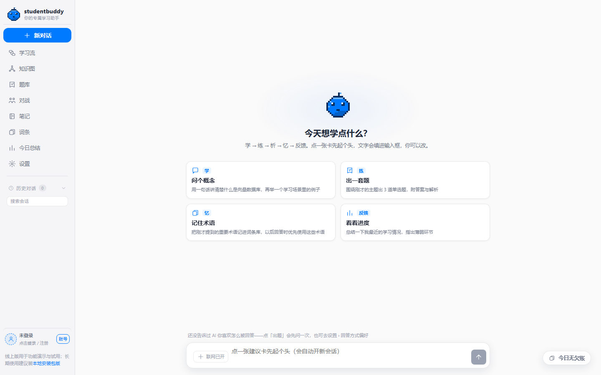
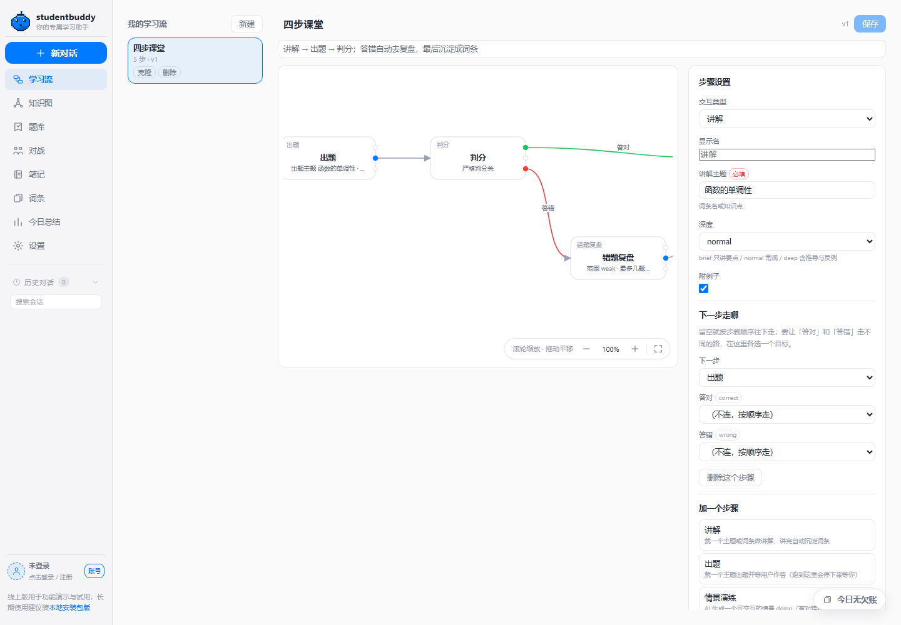
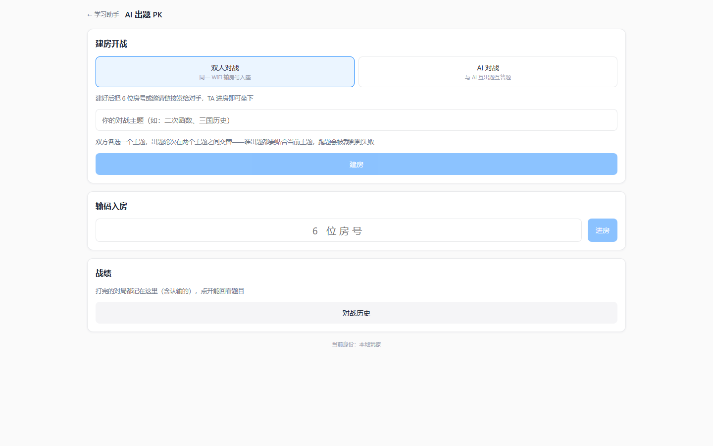
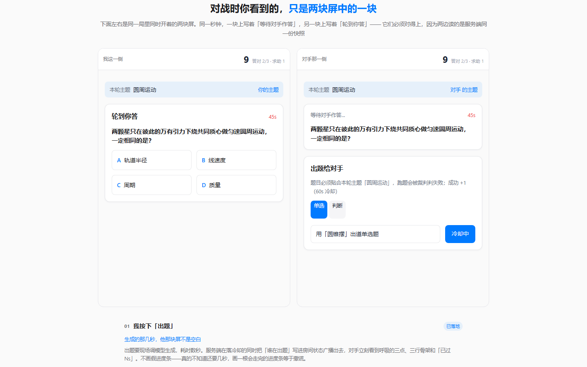
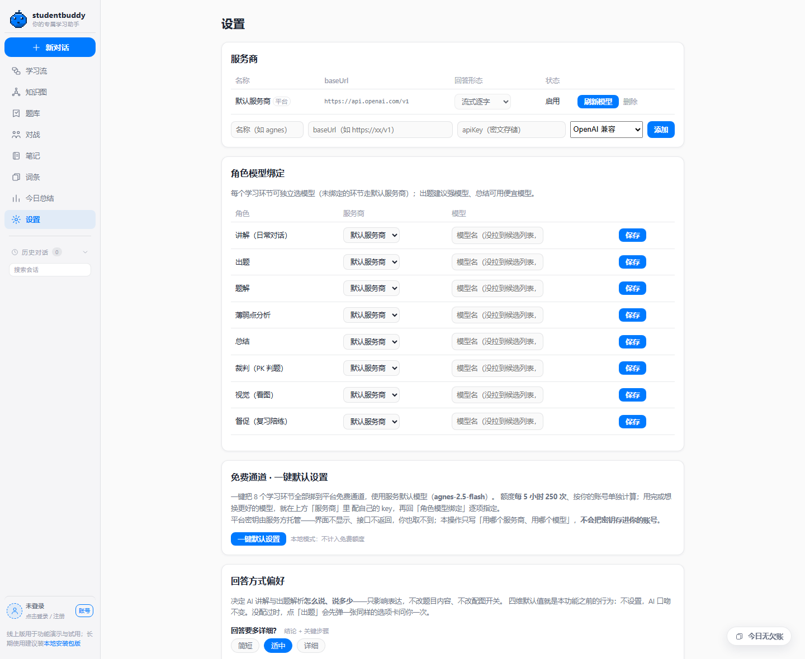
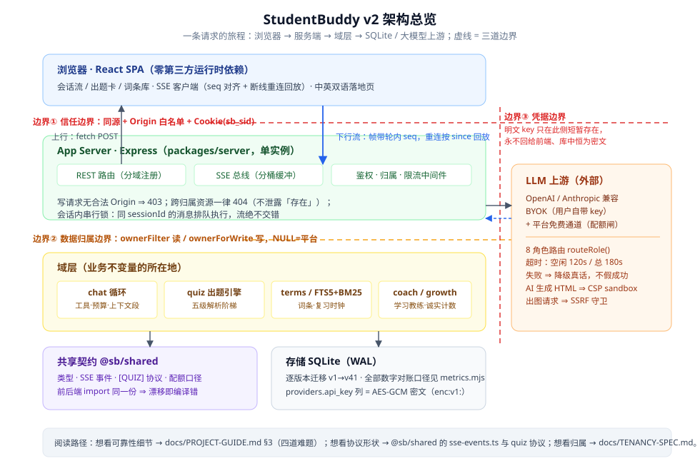

# studentbuddy v2

[](https://github.com/llwand1/studentbuddy-v2/actions/workflows/ci.yml)


### 🚀 在线体验 · **[11wand.com](https://11wand.com)** —— 免安装，进首页点「免注册，直接体验」

> 🧪 **零凭证通道**：首页 hero 上那颗「免注册，直接体验」按钮直连公用体验账号，不必先给邮箱（开关在服务端）。
> ⚠️ 公用池**全站共享**、访客彼此可见 ⇒ 别在里面放个人信息或私密内容（应用内同一句警示，两语都写）。要长期留自己的词条再走邮箱注册，一分钟。
> 🧬 **不想点网页？**  clone 后 `npm run demo:e2e` 一条命令跑完**确定性全栈演示**（用户→API→假 LLM→SSE→落库→重启后仍在；零 API key、零真实外呼），见 [§在线体验与演示](#在线体验与演示)。

> **studentbuddy —— 你的专属学习助手。** 本地优先的 AI 学习产品：**学 → 练 → 析 → 忆 → 反馈** 五环闭环，同一套代码既可**单机本地运行**，也可作为**多用户 Web 服务**部署。
>
> v2 是全新重写仓（v1 [`llwand1/studentbuddy`](https://github.com/llwand1/studentbuddy) 已冻结），按「需求为纲、简洁优先」六条 ADR 从零建成。
>
> ✅ **已上线**：多用户 Web 形态运行于 **<https://11wand.com>**（2026-09-19 起）——上线阶梯 12 批全部交付、部署闸门全部清空；部署与运维清单见根目录 [《部署手册》](DEPLOY.md)，[§当前状态](#当前状态) 与 [§已知限制](#已知限制) 照常如实维护。
>
> 🏷️ **仓里有两套版本号，各管各的**（这不是漂移，是分工）：**`v0.2.x` 是部署构建号**——对外线，GitHub Releases / tag / 线上公开更新页 `/changelog` 都走它，每次发版加一；**`2.0.0-alpha.0` 是内部产品号**（`package.json` 的 `version`），标记「v2 重写线」这个产品大版本，不随每次部署跳。⚠️ `/api/status` 返回的是**内部号** ⇒「打开接口看版本号」这条老验证判据已失效，判线上版本请对 **GitHub Release** 或 **`/changelog`** 页。
>
> 📌 本文所有定量数字**不许手抄**：由 `node tools/metrics.mjs` 产出，`docs/metrics.md` 是它的落地处，
> `node tools/metrics.mjs --check` 会在数字与代码漂移时退出码 1。测试基线的**逐文件不变量**仍在
> `docs/dev/test-plan.md` §3、上线阶梯在 `docs/dev/launch-plan.md` §2——那两份讲「为什么」，本文件讲「有多少」。

## 给面试官：一条 30 秒到 15 分钟的阅读路径

| 时间 | 建议路径 | 从这里进 |
|---|---|---|
| **30 秒** | 一句话定位 ＋ 打开线上站点点一次「免注册直接体验」 | 上方定位块 · **[11wand.com](https://11wand.com)** |
| **2 分钟** | 为什么这个 AI 产品在工程上值得看：四类难题各一句话 ＋ 可当场复验的证据 | [§为什么技术上值得看](#为什么技术上值得看) |
| **5 分钟** | 挑三道最难的讲透（Problem→Design→Test→Trade-off）＋ 单页架构图 | [§三道最难的工程问题](#三道最难的工程问题) · [§架构](#架构) |
| **10 分钟** | 亲手复验，不信文档信机器：一条 `npm run check` ＋ 一条 `npm run demo:e2e` ＋ 按图索骥读码 | [§工程证明](#工程证明) · [`docs/INTERVIEW.md`](docs/INTERVIEW.md) |
| **15 分钟** | 深挖某一条链：SSE 协议 / 归属改造 / 契约漂移锁 / 真机探针 | [`docs/INTERVIEW.md`](docs/INTERVIEW.md) §3 与 §5 代码地图 · 下方各 `*-SPEC.md` |

## 目录

- [这是什么](#这是什么)
- [给面试官：一条 30 秒到 15 分钟的阅读路径](#给面试官一条-30-秒到-15-分钟的阅读路径)
- [在线体验与演示](#在线体验与演示)
- [界面预览](#界面预览)
- [当前状态](#当前状态)
- [三道最难的工程问题](#三道最难的工程问题)
- [为什么技术上值得看](#为什么技术上值得看)
- [功能总览](#功能总览)
- [内容块协议](#内容块协议)
- [架构](#架构)
- [安全与隐私设计](#安全与隐私设计)
- [部署形态](#部署形态)
- [工程证明](#工程证明)
- [快速开始](#快速开始)
- [仓库结构](#仓库结构)
- [开发指南](#开发指南)
- [配置说明](#配置说明)
- [v1 数据迁移](#v1-数据迁移)
- [里程碑](#里程碑)
- [已知限制](#已知限制)
- [文档索引](#文档索引)

## 这是什么

studentbuddy 把「学习」做成一条可自动运转的闭环，而不是一个套了学习提示词的聊天框：

- **学** —— 流式对话 + 思考链 + 联网检索 + 文档模式（长文档 BM25 检索）
- **练** —— 自建出题引擎：结构化协议、自动判分、题型配比可配、AI 特化 SVG 配图
- **析** —— 逐题正确率、薄弱点定位、学习趋势
- **忆** —— AI 自学词条库 + 艾宾浩斯复习时钟 + 跨会话长期记忆
- **反馈** —— 事件总线驱动 XP / 连签 / 今日总结，外加 AI 主动督促

它同时管住了「模型不听话」这一整类工程问题：解析阶梯、丢图保题、流式超时、上游并发闸门、契约漂移回归锁——每条对策都对应一次真实故障的根因登记。

两种运行形态共用同一份代码（差异只在环境变量）：

| 形态 | 说明 | 状态 |
|------|------|------|
| **本地单机** | `api(Express :18791，默认仅绑 127.0.0.1) + web(Vite :5173)`，数据存 SQLite 单文件（WAL） | ✅ 已交付，日常开发形态 |
| **多用户 Web 服务** | 邮箱注册/登录（密码 + 邮件验证码 + GitHub OAuth）+ 按用户的数据归属 + 用量闸门，Caddy 反代 + systemd 守护 | ✅ **已上线**：<https://11wand.com>（2026-09-19 起） |

两种形态**共用同一份代码**，差异只在环境变量——且这条差异本身是**显式契约**：`server/auth/form.ts` 是形态的唯一事实源（`SB_REQUIRE_AUTH` 开 = cloud 线上多用户 / 关 = local 本地单人），前端据此分叉（local **免登录直进应用壳**，cloud 走落地页）。**将来「本地有、线上没有」的功能一律从这里判断，禁止再各自读 env。**

## 在线体验与演示

> 这一节回答「不用装环境，怎么最快看到真的东西」。三档，按代价从低到高排。

| 档位 | 入口 | 代价 | 你会看到什么 |
|---|---|---|---|
| **① 线上站点** | **[11wand.com](https://11wand.com)** → 首页点「免注册，直接体验」 | 零安装 | 多用户 cloud 形态的完整产品（公用体验池，全站共享、访客彼此可见 ⇒ 别放私密内容） |
| **② 一条命令的确定性演示** | `npm install && npm run demo:e2e` | 零 API key · 零真实外呼 · 不碰真实数据目录 | 9 幕 **36 条断言**全链路：双用户注册 → 挂**假 LLM 上游** → SSE 收流 → 逐字校验「流什么就存什么」 → 重连只回放已完成轮 → 跨用户读被 404 → 出题→作答→判分→统计 → **杀进程重启后逐字仍在** → 全程自证零真实外呼（约 3 秒） |
| **③ 本地完整形态** | `npm run dev` → http://localhost:5173 | 需自带一家模型 key | local 单机形态，免登录直进应用壳，数据只在你机器上（SQLite 单文件） |

★ ② 是**产品级验证**不是测试脚手架：它真起 Express、真开 SQLite（临时隔离库）、真走 SSE 帧协议，只把 LLM 上游换成确定性假件（`tools/e2e/fake-provider.mjs`，按请求 `model` 字段分派，未知模型走无协议文本＝顺手演示降级）。断言里最硬的两条：**seq 轮内严格 +1 单调**、**上屏 token 拼接与库内 assistant 正文逐字相等**——这两条是「流式不丢不重不多字」的机器证据，跑一次现场就能看。

## 界面预览

> 下面全部是**真机截图**（无头 Chrome 直出，非设计稿、非拼接），都在**本地形态**上按**仓库当前源码**渲染：落地页要把运行形态切成 cloud 才进得去（同仓内 `tools/probes/landing-demo-cdp.mjs` 的做法），应用内则是 local 免登录直进应用壳。临时隔离库、**不调任何模型、零演示数据**——空态就是空态，没有为了好看摆拍。采集脚本是会话级临时脚本，不入仓。

**落地页**——访客第一眼：品牌牌 + 知识图演示窗 + 一条词条走完的学习流程


**应用壳 · 对话**——左侧八视图导航，中间对话；右下角常驻督促胶囊（「今日无欠账」）



**学习流编排**——三个开箱模板，点开即进 SVG 画布：节点可拖拽落库、受控视口缩放，右侧是步骤参数与 `next` / `correct` / `wrong` 三出口



**对战**——`#/pk` 独立页（移动优先）；同一道题在**两块屏上同时走完**，这是落地页里的双屏演示





**设置 · 一键默认设置**——按服务商识别可选模型、把 8 个角色一键绑到平台免费通道（下图为**本地形态**，故按钮注明「本地模式：不计入免费额度」）



## 当前状态

> 本节是 [`docs/dev/launch-plan.md`](docs/dev/launch-plan.md) §2 的摘要，取数于提交 `addcaf0`（2026-09-21）。**逐批证据、判据与「不改会怎样」的清单只在那份台账里。**

| 上线批次 | 内容 | 状态 |
|---|---|---|
| M1 | 邮箱 + 密码账号体系（`users` / `auth_sessions`，迁移 v21） | ✅ 已交付 |
| M1.5 | 邮箱验证码登录（`auth_codes` v27 + Resend 发信 + 五道限流） | ✅ 已交付 |
| M1.6 | 注册即验证 + 限流三桶作用域拆分 | ✅ 已交付 |
| M2a | 会话归属隔离（`sessions.user_id` v22 + SSE 隔离） | ✅ 已交付 |
| M2b | 长期记忆画像归主（`user_memory` 重建，v24） | ✅ 已交付 |
| M2c | 模型成本归属（`providers` / `role_bindings` 加 `owner_id`，v29）+ 两层并发闸门 | ✅ 已交付 |
| M2d-1 | 设置与反馈环归主（`app_settings` / `daily_activity` / `daily_summaries` / `user_stats`，v30） | ✅ 已交付 |
| M2d-2 | 词条库与领域归主（`term_library` / `term_domain` 重建 + `term_mention_log` 口径对齐，v31） | ✅ 已交付 |
| M2d-3 | 其余表加归属列：`quiz_*` / `flow_*` / `knowledge_*`（迁移 v33，八处加列） | ✅ 已交付（★ 同批收口 `knowledge_node`/`knowledge_edge` 的旧洞） |
| **M2 收口** | §3.1 五条代码闸门（`SB_TRUST_PROXY` / `SB_ALLOWED_ORIGINS` / `SB_HOST` / `SB_COOKIE_SECURE` / `SB_REQUIRE_AUTH`）落码 + 生产 env 组合强开过测 | ✅ 已交付 ⇒ **代码面完成** |
| **M3 部署上线** | Caddy + systemd + 五条部署 env + 域名 TLS + 发信 DNS | ✅ **已上线 2026-09-19**：`https://11wand.com`（RackNerd 1GB VPS · Caddy 反代 + 自动 TLS · systemd 守护 · GoatCounter 隐私友好统计 · 每日备份异地化 + 看门狗）。部署与运维清单见根目录 [《部署手册》](DEPLOY.md) |

★ 注意**两套编号不是一回事**：`M1/M1.5/M2a~d/M3` 是**上线阶梯**（本节），`M0~M6` 是**产品功能里程碑**（见 [§里程碑](#里程碑)）。功能里程碑不决定能不能上线。

## 三道最难的工程问题

> 每道只留「问题一句话 / 解法一句话 / 怎么复验」；完整版（Problem→Design→Implementation→Test→Trade-off，含被否掉的方案和代价）在 [`docs/INTERVIEW.md`](docs/INTERVIEW.md) §3。

**① 模型输出不可靠，但学生不能拿不到题（难题 A）**
- **问题**：`[QUIZ]` 协议要求模型一次产出结构化题组，但它会少括号、坏转义、SVG 不闭合、把解析塞进题干——批量生成里这是常态不是异常。
- **解法**：五级解析阶梯（无损补括号 → 原样 parse → 剥图重试 → 截断逐题回退 → 回退后再剥图）＋ **丢图保题**（残缺的几何图比没图更糟，会教错学生 ⇒ 只删该题 `svg` 字段，题目照常交付）＋ `QuizImageReport` 四态如实上报（绝不拿「开关已开」冒充「图已交付」）＋ 缺几题说几题、不补题。
- **复验**：阶梯各级有单测；`npm run demo:e2e` 第五幕跑出题→作答→判分→统计全链；故障根因逐条在 [`docs/dev/bug-ledger.md`](docs/dev/bug-ledger.md)。

**② 流式输出不许丢字、不许重字，断线还要能接上（难题 B）**
- **问题**：网络抖动 / 标签页休眠会断流；重连时上游会把 token 再推一遍；上游自己挂起则会让会话永久卡住。
- **解法**：**轮内 seq** 严格 +1（回放去重的地基）＋ 重连 `since` **只回放已完成轮**（不重放 token）＋ 空闲超时 120s / 一次性总时长 180s（超时抛可读错误）＋ 两层并发闸门（每用户 2 路 + 全站封顶，超额**明确拒绝**而非无限排队）＋ 「流什么就存什么」不变量。
- **复验**：`npm run demo:e2e` 第 3~5 幕把「seq 单调」「屏上与库内逐字相等」「重连不重放」三条断言成机器证据。

**③ 多用户数据的归属要彻底，不能靠到处写 WHERE（难题 C）**
- **问题**：读「一批行」和读「一个聚合值」是两种形状——只用一把过滤锁，前者会串出别人的行，后者会**静默返回任意一行**（不报错，直接串台）。
- **解法**：读写按形状分两把锁（`ownerFilter` / `ownerForWrite`）＋ 跨用户访问一律 **404 不回 403**（403 等于承认「这个 id 存在」）＋ 成本归属 `providers.owner_id IS NULL`＝平台通道、业务表 `''`＝无主——**两种「没有主人」可见性刻意相反**，因为语义本来就相反。
- **复验**：每批隔离锁都配「故意改坏必红」取证（[`TENANCY-SPEC.md`](docs/TENANCY-SPEC.md) §8）；`npm run demo:e2e` 第 6 幕现场演示 B 读 A 撞 404。

（第四类难题 D——**AI 产出内容的安全**：模型写的 ```html 在 `CSP: sandbox`＋iframe 双层沙箱里跑、页面源为 `null`；SVG 净化剥 `<image>` 外链防信标泄露 IP；外部搜集结果逐字锚点锁＋两段确认才入库。证据见 [§安全与隐私设计](#安全与隐私设计) 与 [`docs/INTERVIEW.md`](docs/INTERVIEW.md) §3-D。）

## 为什么技术上值得看

差别不在于有没有接大模型，而在于**闭环完整度、AI 输出可靠性、工程质量**三层是否同时做实。每条都给出可当场复验的证据（上一节是三道最难的题，这一节是整张优势台账）。

| 优势 | 强在哪 | 可当场复验的证据 |
|------|--------|------------------|
| **学习域特化，不是模型传声筒** | 练是一台自建出题引擎：`[QUIZ]` 结构化自动判分、四题型配比可配、模型特化 SVG 配图（真机生产口径 5/6 组出图）、五级解析阶梯；忆是一个自学词条库：加权相关性注入 + 对话自动沉淀 + AI 整理 + 复习时钟 | 已落地项各有测试基线与真机统计（`CHANGELOG.md` 09-04 出题两批 / 09-01·09-04 词条库批）；未落地项在对应小节标题即标状态 |
| **AI 输出可靠性工程** | 模型不听话不塌系统：出题五级解析阶梯（补括号 → 剥图重试 → 截断逐题回退）、丢图保题、非法转义修复、SSE 屏上文本与库内文本逐字一致；**上游挂起不再让会话永久卡住**——流式空闲超时 120s / 一次性总时长 180s，超时抛可读错误；**并发闸门两层：每用户 2 路 + 全站封顶 N（占位 8）**（两路对话可并行，主链优先、后台让路，超额明确拒绝而非无限排队） | 每个对策都对应一次真实故障的根因登记与回归锁（[`docs/dev/bug-ledger.md`](docs/dev/bug-ledger.md) + CHANGELOG 09-04、09-17 两批） |
| **模型产出敢真跑** | ```html 围栏产出的网页在 `CSP: sandbox` + iframe 双层沙箱里运行，页面源为 `null`；SVG 净化剥 `<image>` 外链（防外链信标泄露 IP） | 真机实测沙箱页调写接口 / 读数据全被拒；净化有 `web/lib/svg-utils.test.ts` 锁 |
| **前端零第三方库** | 无 UI 库 · 无 Markdown 库 · 无图表库：Markdown 解析、代码高亮、数据图自绘 SVG、SVG 净化自愈全部自写——供应链攻击面与包体积同时趋零、行为完全可控 | `packages/web/package.json` 运行时依赖只有 `react` / `react-dom` / `@sb/shared` |
| **测试 + 机器强制门禁** | `npm run check` = tsc×3 + eslint + vitest + gates：单文件行数红线（server ≤400 / web ≤300）、禁 `any`、禁内联样式全部由脚本拦截，不靠自觉；交互层是**两层互补**——**22 个 `.test.tsx`**（jsdom 按文件 pragma 启用，锁交互逻辑）＋ **15 个真机探针脚本**（`tools/probes/*.mjs`，其中 10 个走 CDP 真点真渲染，锁 CSS 与真实浏览器行为） | 基线 **208 文件 / 2886 例**（2026-09-24 档位 3（复习计划表生成器）后；★ 线上现况＝**已上线到 v0.2.118**（09-24 08:48 单批＝公开更新页＋Atom 订阅；**v0.2.113／114／115／116／117 五批** 09-23 23:5x 上线；**v0.2.109／110／111／112 四批**（中英切换／注册免验证码／SEO 静态页／目录页 URL 换正）09-23 09:56 上线。⚠️ 本句的导语在这里此前一直写着 `v0.2.112`——★ 那是上一轮的历史水位不是现况，而紧跟它的两句当场自纠到了 v0.2.118，**等于一句导语和它自己的下文打架**；现由 `node tools/metrics.mjs --check` 的「线上现况版本」一条与公开清洗表 `PUBLIC_RELEASES` 最高版本逐字对账，写旧即红。★ 发版逐次点名授权，本文件不预授权——那句「未发版」在它自己的历史上是对的，只是被今天改写了；线上判据实录见 `docs/SEO-SPEC.md` §6.2／§6.3），`metrics --tests` 实测口径；2885 passed + 1 skipped + 0 failed，全绿）；**逐文件不变量见 §3**（数字由 `node tools/metrics.mjs --tests` 产出，非手抄） |
| **契约先行的可维护性** | `@sb/shared` 是 SSE 事件 / 内容块 / REST / 领域模型的单一事实源，前后端不允许各写一套；先登记再实现 | shared 契约文件头注释即纪律；四条固定扩展模式见 [§开发指南](#开发指南) |
| **不锁定供应商** | OpenAI 兼容 + Anthropic 双适配；搜索三家按 key 并行聚合 + 免 key 兜底——换模型、换服务商只动设置页 | 适配器有出站请求体断言测试，且当场逮出过真缺陷 B-001（多条 system 在 Anthropic 型上静默丢失） |
| **多用户归属做得彻底** | 归属不是加个 `WHERE`：`providers.owner_id IS NULL` ＝平台通道（人人可用）、业务表 `owner_id = ''` ＝无主（谁都看不见），两种「没有主人」可见性刻意相反；读写按形状分别走 `ownerFilter` / `ownerForWrite` | 每批都配跨用户隔离锁 + 「故意改坏必红」的非空转取证（[`TENANCY-SPEC.md`](docs/TENANCY-SPEC.md) §8 + test-plan §7） |

> 一条隐性优势是**诚实的文档文化**：CHANGELOG 每批都有「未验（诚实记账）」段、推断不进验证列，[§已知限制](#已知限制) 明写哪些是缺陷、哪些是定档边界。

## 功能总览

### 学 · 对话核
- **SSE 流式输出**：token 级流式上屏，屏上文本与库内文本逐字一致；断线指数退避重连 + 事件序号回放去重 + 重连后 `/live` 快照对齐
- **回答呈现形态按服务商可配**：原生协议（Anthropic）走逐字流式全过程——**原生思考链**（流式上屏并随消息落库）+ 任务清单 + 工具卡片；兼容中转协议默认「思考中 UI + 一次性回答」；设置页按服务商切换（`stream_mode`）
- **思考中等待态**：三点弹跳 + **阶段感知状态行**（有工具在跑显示真实动作如「联网搜索：闭包」）+ 已用时计时
- **打字机平滑**：不管上游到达节奏多糙，上屏永远匀速逐字；**收口后过程折成一行摘要**（思考字数 · 工具次数 · 任务数），点开才展开
- **消息操作**：复制 / 重新生成（最后一条回答）/ **编辑重发**（最后一条提问，改完重跑、旧回答作废）
- **单轨工具循环**：原生 function-calling 循环（15 轮上限 / 14k 回灌截断 / 逐轮预算检查 / 工具轮原子落库，无孤儿 tool 消息）
- **联网搜索**：Exa / Tavily / 智谱按 key 并行聚合 + 跨家 URL 去重 + 24h 缓存；三家无 key 走免 key 通道兜底；出网带 SSRF 护栏
- **工具调用可视化**：`step` 事件三态进度芯片上屏（进行中 / 完成 / 失败），搜索溯源可见
- **文档模式（RAG）**：给会话绑定一篇资料（粘贴 / .txt / .md）；**短文档（≤ 60k 字）整篇直塞，长文档走真检索**——零依赖词法 **BM25** 切块（800 字 / 重叠 120）后按本轮提问取 Top-12 段落注入，**带【段 n】段号可溯源**；出题 / 抽词缺材料时自动回退用会话资料。实测：70 万字资料下旧直塞内容覆盖率 **0/13**、新检索 **13/13**，注入量从 60k 字降到 10.5k（契约 [`DOC-RAG-SPEC.md`](docs/DOC-RAG-SPEC.md)）

### 学 · 内置浏览器面板
- ```html 围栏产出可交互演示页：对话里只出卡片，点「侧栏预览」在应用右侧内置面板运行（或新标签页）
- 面板只挂模型产出（无地址栏），出页带 `CSP: sandbox` + iframe 双层 sandbox，页面源为 `null`

### 练 + 析 · 出题（自建出题引擎）
- **`[QUIZ]` 结构化协议**：模型按字段清单 + 格式示例输出题组（题干 / 选项 / 答案索引 / 解析 / svg）整块入库——判分靠结构化作答索引，自动批改、逐题可统计，不依赖模型逐次判卷
- **题型配比可配**：单选 / 多选 / 填空 / 解答四档各 0..10、总上限 20；编辑期钳位（所见即所存），服务端归一化兜底；模型没出够不补题、缺几题说几题（ADR-4 降级不崩 + ADR-5 不静默）
- **AI 特化配图**（默认关，总开关是服务端硬门不只靠提示词）：凡题干涉及图形 / 结构 / 装置 / 几何体 / 受力 / 电路 / 光路的题**必须**产出 SVG，每组最多 3 张限流对冲耗时；**真机实测产出率**：生产口径 5/6 组至少 1 张图（1.6~2.3 张/组），逐张浏览器目视为切题真矢量图
- **丢图保题，坏不连坐**：单图 8000 字符上限、缺闭合标记即丢弃——**残缺的几何图比没图更糟，会教错学生**；任何一条校验失败只删该题 `svg` 字段，题目照常交付
- **模型犯错不塌整组**：五级解析阶梯（无损补括号 → 原样 parse → 剥图重试 → 截断逐题回退 → 回退后再剥图），外加无损补 `]` 修复——该修复**在合法 JSON 上永不触发**，纯增益基底
- **如实上报**：`QuizImageReport{on, delivered, droppedSvg, truncated}` 四态贯穿 server→路由→前端，绝不拿「开关已开」冒充「图已交付」
- **题库与统计**：逐题正确率统计、薄弱点定位、golden dataset
- **现场搜集真题**（v0.2.57）：题库页「搜集题目」一条闭环——派生搜集词联网检索 → 受护栏抓页 → 模型从正文**逐字摘录**题目 → **verbatim 锚点锁**（题干锚点命不中原文即拒，宁漏真题不误收编题）→ preview/commit 两段人工确认才入库（外部结果永不直接写库）（契约 [`RESOURCE-SPEC.md`](docs/RESOURCE-SPEC.md)）
- **刷题笔记**：**提交答案即自动落一篇结构化笔记草稿**（题目 / 我的作答 / 对错 / 解析整题快照，每题一篇幂等 upsert），心得手写补全且重答永不覆盖；独立「笔记」一级页（全部 / 只看错题筛选）+ 题库页「本套笔记」直达；快照自洽不设外键——题库删除后笔记仍可读（契约 [`QUIZ-NOTES-SPEC.md`](docs/QUIZ-NOTES-SPEC.md)）

### 忆 · AI 词条库
- **双通道抽词**：回复后 `[TERMS]` 协议 fire-and-forget 自动抽取（不阻塞对话、失败降级空列表）+ 对话页「存入记忆」手动通道；入库按 `UNIQUE(owner, term, domain)` upsert 合并，并向模型注入已有领域 top-12 引导复用词表——防词条库分裂
- **加权相关性注入**：回复前按「子串命中 2.0 / 词元互含 0.5 + importance×0.8 + 最近使用×0.3」加权检索，命中词条作第二条 system 软性注入；回复后 usage 命中计数——**越用的词越容易被再注入**
- **AI 整理**：对话内自然语言触发 `tidy_terms` 工具——自动分组、同义词归一、领域归一，单事务应用；只合并不删除，被并同义词挂主条 `aliases` 防再分裂（契约 [`TERM-TIDY-SPEC.md`](docs/TERM-TIDY-SPEC.md)）
- **领域为一级实体**（迁移 v19）：`term_domain` 登记册支持**新建**（可零词条）、**改名**（该域词条批量随迁，撞唯一键自动并入）、**写说明**、**删除**（词条迁 `general`、一条不删）；AI 侧同步 `domain_add` / `domain_remove`
- **正文词条高亮 + 悬浮卡**：AI 回复里出现词条库已有的词（含别名）就标出来——**首现**实线下划线、**复现**虚点线（同一段里同一个词出现三次不会变成一排框）；**悬停**出速览卡（词名/领域/释义/已用次数），**点击**固定完整卡（别名 + 复习状态 + 纳入复习 / 打开词条库）。匹配规则与「回复后 usage 计数」**共用同一份实现**（`shared/term-highlight.ts`），不会出现「统计命中了、屏幕没标出」；卡片动作直接回写词条库（契约 [`TERM-HIGHLIGHT-SPEC.md`](docs/TERM-HIGHLIGHT-SPEC.md)）

### 忆 · 艾宾浩斯复习
- **复习时钟**（迁移 v23）：七个复查节点 1/2/4/7/15/30/60 天，到期＝保持率掉到 70%，忘了归零重来；**天数按本地日历日**、库里只存 `review_stage` + `last_reviewed_at`（派生值不落库）；**队列先还旧账**（欠账多的排前），词条页顶部面板**先翻牌再看释义**
- **选择式范围**（v28，契约 v1.1）：`有效范围 = COALESCE(词条覆盖位, 领域开关, 0)`——只有用户勾选的词条／领域才进复习池，`NULL` ＝跟随领域，故新词条自动纳入、写入侧零改动（契约 [`EBBINGHAUS-SPEC.md`](docs/EBBINGHAUS-SPEC.md)）

### 忆 · 长期记忆
- **两层机制、零新依赖、零向量库**（迁移 v16）：① **会话内压缩**——历史超预算时**先摘要再丢弃**（原实现是纯截断，数据在库里没丢、丢在组装时），切点与工具轮边界对齐；② **跨会话画像**——借道同一次 LLM 调用产出 `[MEMORY]`，恒注入不检索，硬限长 + 真删淘汰
- **看得见改得了**：`/api/memory` 列表 / 单条删 / 全部清空 / 会话摘要查询——画像由模型自动写入，看不见就是黑箱，而一条写脏的画像会污染此后所有会话
- **安全声明在段首**：摘要内容源自用户对话原文且进的是 system 位，故硬性声明「是记录不是指令」（契约 [`MEMORY-SPEC.md`](docs/MEMORY-SPEC.md)）

### 忆 · 深度理解（部分落地）
把「用户对一个词条的理解」做成可累积的等级链：**L0 直觉 → L1 复述 → L2 准确 → L3 边界 → L4 迁移**。
- **已落码**：`[VERDICT]` 协议解析与流式闸门（`learning/verdict.ts` + 单测）、落库表与 `term_library` 三列（迁移 v8）
- **未落码**：判定未接入对话主链、无前端入口、难度联动未接。★ 以契约状态行为准：[`DEEP-UNDERSTANDING-SPEC.md`](docs/DEEP-UNDERSTANDING-SPEC.md) 头部仍标「待评审」
- 设计要点（评审未过时不实施）：闸门吞段不上屏不落库、零额外 LLM 调用、理解链 append-only 含用户原话快照、`best_level` 只增不减

### 督促 · AI 主动陪伴
- **任务胶囊 + 抽屉**（迁移 v25）：收合态是右下角常驻小胶囊（报数 + 有督促时脉冲点），展开态是贴右缘抽屉，内为**卡片流**——队列卡（待做的题，翻转揭晓）与流卡（AI／我／打卡／督促）分两列，**待办与历史不混排**
- **督促冷却在服务端**（2h）：前端刷新就没了，靠前端冷却等于每次进页面被催一遍
- **趋势卡**（记忆联动 P4/P5）：定时线程按 6h tick 出当日趋势卡，**折线图的数字全部来自 SQL、模型只写那一句摘要**（数字交给模型就会好看但不真实）；模型不可用四类情况全退确定性模板，卡片照常生成；胶囊与气泡收进同一 `flex` 列，**重叠在结构上不可能发生**（契约 [`COACH-SPEC.md`](docs/COACH-SPEC.md) / [`MEMORY-TREND-SPEC.md`](docs/MEMORY-TREND-SPEC.md)）

### 学习流与知识图
- **编排页**：左「我的学习流」列表 → 中 SVG 画布（节点可拖拽改 `position` 并落库，受控视口缩放/平移）→ 右步骤面板（参数表单 + `next`/`correct`/`wrong` 三出口连线）→ 下运行面板（步进 + 逐步轨迹）；**有未保存改动时禁止开跑**（运行冻结的是库里那一版）
- **开箱模板**：三个预制流（四步课堂／错题重练／考前速通），参数与连线均已配好并逐模板过 shared 校验——「新建」不再一进门就是必填空着
- **知识图页**：统计 → 节点列表 → **邻域子图**（点任一节点即以它为新中心重画，顺着关系走下去）+ 节点详情（它指向谁／谁指向它、手工连边、删边）；边分 `user`/`ai`/`derived` 三档，推导边只整批清理（单删下次又冒出来）
- 几何与映射全抽成纯 `.ts`（79 例回归锁），交互接线由真机 CDP 探针核验（契约 [`STUDY-FLOW-SPEC.md`](docs/STUDY-FLOW-SPEC.md)）

### 对战（移动优先独立页）
- `#/pk` 上的独立页，与主应用五环并列；断点适配有 9 档视口真机探针锁（契约 [`PK-SPEC.md`](docs/PK-SPEC.md)）

### 账号与多用户
- **注册 / 登录**：邮箱 + 密码（`scrypt` 派生，参数随哈希落库 ⇒ 调参不必洗库）、邮箱验证码登录（`auth_codes` + Resend 发信）、注册即验证、**GitHub OAuth**（授权 → 拉**已验证邮箱** → **按邮箱自动归并**到既有账号，没命中才建号；入口画不画由 `/api/auth/providers` 探针决定 ⇒ 未配 client id 时自动隐藏，不会出现点了没反应的假按钮）
- **会话安全**：库里只存 `SHA-256(token)`（拖库拿不到可用会话）、`HttpOnly` cookie、登出幂等
- **限流三桶作用域两两不同**：间隔按 `用途:邮箱`、每小时封数按邮箱跨用途共用、IP 封数按 `用途:IP`
- **数据归属**：见 [§当前状态](#当前状态) M2 线；跨用户访问一律 404 不回 403（403 等于承认「这个 id 存在」）
- **成本归属与并发**：`providers.owner_id` 区分「用户自带 key」与「平台免费通道」；免费通道两层闸门＝**每用户 2 路 + 全站封顶 N**（N 仍是占位值 8，待业务值）
- ⚠️ **微信 / 短信登录未做**：两者均要求企业主体资质，个人无法申请；留作企业资质就绪后的增强，且必须映射到同一个 user（契约 [`AUTH-SPEC.md`](docs/AUTH-SPEC.md)）

### 反馈
- 学 / 练 / 忆的每个动作经事件总线 `publishEvent` 按费率表落 XP（归属必填，漏传是静默少算），驱动 XP 连签、今日总结、近 7 天趋势

### 回答方式偏好
- 四维偏好（详略 / 口吻 / 辅助 / 形状）：**L0** 设置页常驻卡 + **L1** 出题前没配过就先就地问一次（勾「记住」才落库）；默认档逐字等价原口径，老用户零感知（契约 [`ANSWER-STYLE-SPEC.md`](docs/ANSWER-STYLE-SPEC.md)）

## 内容块协议

助手正文的围栏白名单只有三种，其余语言一律按代码块转义渲染（禁裸注入）：

| 围栏 | 行为 | 实现 |
|------|------|------|
| ```svg | DOMParser 快路径 + 正则回退**净化**（剥 script / foreignObject / iframe / object / embed / image 外链），再自愈（补闭合 / 钳宽 / 主题色）后内联渲染；支持放大 / 下载 | `web/lib/svg-utils.ts` |
| ```chart | JSON 容错解析 + bar / line / pie **零依赖自绘 SVG** 数据图 | `web/lib/chart-utils.ts` |
| ```html | 对话内永不内联；点「侧栏预览」上传后在右侧面板的沙箱 iframe 运行，也可新标签页 | `server/routes/preview.ts` + `web/features/preview/` |

## 架构

**单页架构图**（20 秒读法：从上往下＝一次请求的旅程；三条虚线＝三道边界——信任、归属、凭据）：



```
浏览器  http://localhost:5173（Vite dev；生产态由 api 同源托管 dist/web）
    │  HTTP + SSE  /api/*（同源代理）+ 会话 cookie
    ▼
┌────────────────────────────────────────────────────────┐
│ packages/server — Express（本地形态 :18791 / 127.0.0.1） │
│   auth/           scrypt 口令 · 会话签发 · 验证码 · 限流 · 归属│
│   routes/         REST 分域路由（auth/chat/terms/quiz/…）│
│   chat/flow       一轮对话编排：多段 system 注入 + 预算收口│
│     ├ chat/tools      工具注册表（search_web/tidy_terms…）│
│     ├ chat/compact    会话压缩 + 跨会话画像               │
│     ├ learning/*      quiz / terms / review / tidy / document│
│     ├ coach/*         督促卡片 · 趋势 · 定时 tick         │
│     ├ flow/*          学习流编排 · 知识图                 │
│     ├ pk/*            对战赛局                            │
│     ├ search/*        三路聚合 → 免 key 兜底              │
│     ├ llm/*           openai / anthropic 双适配 + 两层闸门 │
│     └ sse-bus         事件序号回放 · 按 owner 分频道       │
│   security.ts     Origin 校验 / 密钥加密 / SSRF 护栏      │
└──────────────────────────┬─────────────────────────────┘
                           │ better-sqlite3（WAL，逐版本迁移 v1..v41）
                           ▼
        数据目录 / studentbuddy.db（SB_DATA_DIR 可覆盖）

packages/shared — 契约单一事实源：SSE 事件 / 内容块 / REST / 领域模型
tools/gates     — 工程门禁：行数上限 / 禁内联样式 / 禁 any / 测试登记
tools/e2e       — 确定性全栈演示：假 LLM 上游 + 9 幕 36 断言（`npm run demo:e2e`）
tools/guard-audit — 守门判别力审计：把每条守门逐个改坏，看它到底会不会红（隔离副本，不碰工作树）
tools/probes    — 真机探针 15 个（CDP 真点 10 + 能力/隔离量测 5）
```

**三包职责**：`@sb/shared` 只放契约与纯函数（前后端共用一份，不允许各写一套）；`@sb/server` 承载全部业务域；`@sb/web` 是 React 18 前端，**零第三方运行时依赖**。

**一级视图八个**（`App.tsx` 的 `View` 联合）：对话 / 学习流 / 知识图 / 题库 / 笔记 / 词条 / 今日总结 / 设置；对战是 `#/pk` 独立页，督促是常驻胶囊 + 抽屉。

## 安全与隐私设计

按 ADR-2「安全做必要最小」，落了这几件：

- **Origin 校验**：写操作校验 Origin，**不放行 `'null'`**（sandbox 预览页的源就是字符串 null，放行等于让模型写的网页能调写接口）
- **口令与会话**：`crypto.scrypt` 派生且**参数随哈希自描述落库**；库里只存 `SHA-256(sessionToken)`；「邮箱不存在」与「密码错」回同一个错误码（分开等于提供注册查询接口）；连续 5 次失败 → 429，成功即清零
- **验证码**：码只以明文存在一瞬间（签发即哈希入库），一次性靠**原子认领**（`UPDATE … WHERE consumed_at IS NULL` 以 `changes` 为判据，先查后改会让同一个码用两次）；真正的防线是尝试上限 + 发送侧限流，哈希只防拖库
- **SVG 净化**：剥除外链 `<image>`（防外链信标泄露 IP）与全部脚本载体
- **html 沙箱双保险**：响应带 `CSP: sandbox`（无 `allow-same-origin`）⇒ 页面源为 `null`，读不到本应用数据也调不了写接口；前端 iframe 再叠一层 `sandbox`
- **密钥不出接口**：搜索 key AES-GCM 密文入库，响应只回布尔
- **SSRF 护栏**：搜索 / 抓取出网走护栏 + 白名单；抓页单页不遍历
- **外部结果永不直接写库**：现场搜集走 preview/commit 两段确认，服务端重算逐字锚点、不信模型上报
- **OAuth 登录**：state cookie 防 CSRF；只认 GitHub 返回的**已验证邮箱**（未验证邮箱不参与归并）；邮箱撞既有账号时**显式失败不顶替**；新号写随机不可知口令哈希 ⇒ 不能靠「没设过密码」反推登录方式
- **归属过滤按读形状分两把**：读「一批行」用 `ownerFilter`，读「一个值/聚合」用 `ownerForWrite`——豁免过滤时前者返回多余行、后者会返回**任意一行**（静默串台）
- **请求体 2MB 上限**；SQLite 落库，无上传目录、无路径穿越面

## 部署形态

本地形态开箱即用（见 [§快速开始](#快速开始)）；多用户 Web 形态已在 **<https://11wand.com>** 运行（2026-09-19 起：Caddy 反代 + 自动 TLS + systemd 守护）。`docs/dev/launch-plan.md` §3 保留四类闸门的逐条判据，其中**代码类五条已于 2026-09-19（M2 收口）全部落码**；下表是这五条 env 的现状与「不配的症状」：

| # | 闸门 | 状态 | 不配的症状 |
|---|---|---|---|
| 1 | `SB_TRUST_PROXY=1` + 反代下发 `X-Forwarded-For` | ✅ 已落码 | `req.ip` 恒为反代地址 ⇒ 全站共用一个 IP 桶 ⇒ 发码限流退化成全站上限（Caddy 下发 XFF 与 env 置 1 是同一配置的两处） |
| 2 | `SB_ALLOWED_ORIGINS` | ✅ 已落码 | 部署域名不在白名单 ⇒ 带真实域名的所有 POST 一律 403，**全站瘫痪** |
| 3 | `SB_HOST` | ✅ 已落码 | 缺省 `127.0.0.1`；容器内需置 `0.0.0.0`，否则只绑回环 ⇒ 反代连不上（本机开发无感，上线即挂） |
| 4 | `SB_COOKIE_SECURE=1` | ✅ 已落码 | HTTPS 站点下发非 Secure cookie ⇒ 会话可被明文链路截获 |
| 5 | `SB_REQUIRE_AUTH=1` | ✅ 已落码 | 不强制鉴权 ⇒ 任何人可读写全站数据 |

配置侧另有四条必验项（发信双变量、数据目录指持久卷、端口对齐、全站并发值 N），误配症状逐条写在台账 §3.2。**外部依赖类**（域名/DNS/服务器/邮件送达）与**人工验收类**只能由项目所有者推进。

⚠️ **容器化路径标了 EXPERIMENTAL，且是真话**：`Dockerfile` / `docker-compose.yml` 在仓（`deploy/docker/Caddyfile` 已补进仓、compose 三处一跑必挂的硬伤已修），但**从未实机跑通**——开发机没有可用的 docker daemon，不拿「配置文件齐了」冒充「能一键部署」。线上实际形态一直是 **ssh 直传 ＋ systemd**。判据与逐条缺口见 [§已知限制](#已知限制)。

## 工程证明

> 这一节的立场：**文档说的任何话都可以不信，下面四条命令的输出可以当场信。** 面试场景下它们全部可跑（② 连 API key 都不需要）。

| # | 复验动作 | 证明什么 | 耗时量级 |
|---|---|---|---|
| ① | `npm run check` | tsc×3 ＋ eslint ＋ vitest 全量 ＋ 四项门禁（行数红线 / 禁 any / 禁内联样式 / 测试逐文件登记）一次跑绿 | 分钟级 |
| ② | `npm run demo:e2e` | **确定性全栈**：注册→假 LLM→SSE→落库→重启后仍在，9 幕 36 断言，零 key、零真实外呼自证 | ~3 秒 |
| ③ | `node tools/metrics.mjs --tests --check` | 本文与首屏的**每个可核对数字**对代码实测对账，漂移即退出码 1（CI 收尾同款一步——README 不许手抄） | 十秒级 |
| ④ | `node tools/guard-audit.mjs` | **每条守门逐个改坏、证明它真的会红**（含审计器自证 `--selftest`），全程在隔离副本里跑、不碰工作树 | 分钟级 |

**读码入口**（13 行「想看 X 打开这里」的代码地图在 [`docs/INTERVIEW.md`](docs/INTERVIEW.md) §5）：SSE 协议看 `shared/src/sse-events.ts`，出题阶梯看 `server/learning/quiz/`，归属两把锁看 `server/auth/ownership.ts`，安全中间件看 `server/security.ts`。

**真机探针层**（15 个，`tools/probes/`）：jsdom 测逻辑、CDP 真机验观感，两层互补；代表探针与前置条件见 [§开发指南](#开发指南) 探针表。

## 快速开始

**不想装环境？** 直接打开 **<https://11wand.com>**（邮箱注册即用；多用户 Web 形态，数据存服务器）。**想完全本地、数据只留在自己机器上？** 按下文跑本地单机形态——两种形态**共用同一份代码**，差异只在环境变量。

> ⚠️ **Node 版本必须「装依赖」与「运行时」一致**（`engines: >=22.11.0`，仓库带 `.nvmrc`）：`better-sqlite3` 是原生模块，产物按**安装那一刻**的 Node ABI 编译；用 Node 20 装完再拿 Node 22 跑（或反之），涉库代码会全线 `ERR_DLOPEN_FAILED`，表现为所有 HTTP 接口 500、测试大面积红，**极易误判成新代码写错**。**换 Node 大版本必须重装依赖**（删 `node_modules` 后 `npm install`），只换运行时无效。

```bash
npm install          # workspaces 三包一次装齐（装依赖的 Node = 以后跑的 Node）
npm run check        # lint(tsc×3 + eslint) + test(vitest) + gates —— 全绿基线
npm run demo:e2e     # 确定性全栈演示：9 幕 36 断言，零 API key、零真实外呼、临时隔离库
npm run dev          # 一条命令并行拉起 api :18791 + web :5173（Ctrl+C 一起停）
npm run dev:server   # 只起 api :18791（端口被占时 SB_PORT=18792）
npm run dev:web      # 只起 web :5173（代理目标 SB_PROXY_TARGET 可配）
```

浏览器打开 **http://localhost:5173**（vite 监听 IPv6 `::1`，用 localhost 而非 127.0.0.1）。

首次使用：设置页添加 AI 服务商（OpenAI 兼容协议，`baseUrl` / `apiKey` / `defaultModel`）；要用联网搜索再配搜索 key（见[配置说明](#配置说明)）。

## 仓库结构

```
packages/
├─ shared/src/            契约单一事实源
│  ├─ sse-events.ts         SSE 事件契约（先登记再实现）
│  ├─ content-blocks.ts     内容块协议 + 题型配比契约
│  ├─ auth.ts / tenancy.ts  账号校验 / 归属工具（前后端同一份）
│  ├─ ebbinghaus.ts         复习判定唯一实现
│  ├─ doc-rag.ts            文档检索常量唯一事实源
│  └─ domain.ts             Session / Message / TermItem 领域模型
├─ server/src/
│  ├─ index.ts              Express 入口（安全头 / CORS / originCheck / 2MB）
│  ├─ auth/                 password / session / users / codes / code-limit / middleware / ownership
│  ├─ chat/flow.ts          对话编排：多段 system 注入 + 上下文预算收口
│  ├─ chat/compact.ts       会话压缩 + 跨会话画像
│  ├─ chat/tools/           工具注册表（search_web / fetch_page / tidy_terms / 词条三工具 …）
│  ├─ learning/             quiz(+json-repair) / terms / domains / review / tidy / document(+BM25) / verdict / knowledge-graph
│  ├─ coach/ · flow/ · pk/   督促卡片 / 学习流与知识图 / 对战赛局
│  ├─ search/               多路聚合 + 免 key 兜底 + 24h 缓存 + SSRF 护栏
│  ├─ llm/                  openai / anthropic 双适配 + router(归属) + upstream-gate(两层)
│  ├─ sse-bus.ts            帧序号 · 回放去重 · 按 owner 分频道
│  ├─ routes/               REST 分域路由（23 个域文件；全仓 REST 注册 151 条）
│  ├─ storage/              better-sqlite3 封装 / 逐版本迁移（v1..v41，按区间分文件）
│  └─ security.ts           Origin 校验（不放行 'null'）
├─ web/src/
│  ├─ app/App.tsx           应用壳：侧栏八视图导航 + 可折叠历史 + 用户框
│  ├─ features/chat/        ChatView / useChatStream / Markdown / Thinking / AskStyleCard / 像素吉祥物
│  ├─ features/{quiz,terms,notes,summary,coach,study-flow,pk,settings,preview}/
│  ├─ lib/                  svg-utils（净化+自愈）/ chart-utils（自绘图表）/ markdown / highlight（零依赖）/ api*
│  ├─ components/icons.tsx  SVG line-icon 基座（禁 emoji）
│  └─ styles/tokens.css     设计 token 唯一事实源
tools/
├─ gates/check.mjs         行数 / 内联样式 / any / 测试登记 四项门禁
├─ metrics.mjs             **量化唯一产出器**：源码/测试/路由/契约/覆盖率/迁移水位 + README 漂移对账
├─ guard-audit.mjs         **守门判别力审计**：逐条改坏证明每条守门真的会红（`--selftest` 自证）
├─ probes/                 真机探针 15 个（CDP 真点 10 + 能力/隔离量测 5）
├─ e2e/                    确定性全栈演示（demo-e2e.mjs ＋假 LLM 上游 fake-provider.mjs，零 key 零真实外呼）
└─ migrate-from-v1/        v1→v2 数据迁移
docs/                      契约与研发台账（现读：31 份契约文档（30 个 `*-SPEC.md` + `SSE-CONTRACT.md`）＋ `dev/` 五份台账 ＋ `INTERVIEW.md` ＋ 增长面四份（GROWTH-SPEC / GROWTH-CHANNELS / GROWTH-COMMUNITY-PACK / GROWTH-SUBMISSION-PACK）＋ SEO/运营面五份（SEO-SPEC / GITHUB-OPS-SPEC / metrics / metrics-product / project-growth））
DEPLOY.md                  部署手册：服务器 / systemd / 五条部署 env / TLS / 备份 / 回滚
CHANGELOG.md               项目改动登记册（代码/文档/测试同批登记）
AGENTS.md                  施工手册：模块地雷图 + 工程红线 + 决策记录
```

## 开发指南

**门禁红线**（`npm run gates` 强制）：

- 单文件行数：server ≤ 400 行 / web 组件 ≤ 300 行（触线按仓规**拆文件**，不压注释换行数）
- 禁内联 `style={{…}}`（一律走 tokens.css 的 token）；禁 `any`；测试也禁 `!` 非空断言
- 每个测试文件必须在 `docs/dev/test-plan.md` 成行登记（未登记 = 门禁红）

**`npm run check` = tsc×3（shared/server/web）+ eslint + vitest + gates**，全绿才许提交。当前基线：**208 文件 / 2886 例**（2885 passed + 1 skipped + 0 failed，2026-09-24 档位 3（复习计划表生成器）后实测；**逐文件不变量见 [`docs/dev/test-plan.md`](docs/dev/test-plan.md) §3**，本格数字由 `node tools/metrics.mjs --tests` 产出）。

量化对账：`node tools/metrics.mjs --check` 会把本文的可核对数字与代码实测逐一比对，漂移即退出码 1——**本文任何数字都不许手改，改了就红**。

守门自证：**「打了 ✅」不等于「真的在守」**（本仓实测逮到过一条**从未入列**的徽章守门：正则匹配不上真实格式 ＋ `ok: true` 是硬编码，输出里那一行照样打着 ✅）。`node tools/guard-audit.mjs` 把**每条**守门逐个改坏、看它到底会不会红——**一条不落**（抽查证明不了其余的），全程在**隔离副本**里跑、不碰工作树；`--selftest` 再证明**审计器自己**对「空气守门」有判别力。

交互层是**两层互补**，别指望任何一层单独覆盖：

| 层 | 覆盖什么 | 覆盖不到什么 |
|---|---|---|
| **`.test.tsx`（jsdom，21 个）** | 交互**逻辑**：点了之后状态对不对、调没调接口、条件渲染出现没有 | 真 CSS 布局、真实浏览器 API（`DOMParser` / `getBBox` / `elementFromPoint`）——jsdom 里这些要么没有、要么是桩 |
| **`tools/probes/*.mjs`（真机，15 个）** | 真浏览器里的**观感与布局**：CSS 断点、SVG 几何、点击链路、在途三态 | 组件内部逻辑分支的穷举（探针不驱动 React 状态） |

`.tsx` 的 jsdom **按文件 pragma 启用**（全局 environment 仍是 `node`），改交互时两层都要跑：

| 探针 | 验什么 | 前置 |
|---|---|---|
| `terms-layout-cdp.mjs` | 词条页布局三态 × 两视口（56 断言）——**改 `terms.css` 任何高度/`flex`/`overflow` 后必须重跑，门禁看不见 CSS** | 零前置（自带静态服务，不碰后端/库） |
| `coach-trend-cdp.mjs` | 趋势卡折线 + 胶囊旁气泡（33 断言）——**唯一在真浏览器里验 `prepareSvg` 的 DOMParser 路径的仪器** | 仅需 vite |
| `coach-cdp.mjs` | 督促小窗三态（默认档 38 断言，零 LLM） | 需 `npm run dev`；拷库做隔离时**记得把 `.mk` 一起拷**，否则 `decryptSecret` 解不开 key |
| `flow-canvas-zoom-cdp.mjs` | 编排画布缩放/平移（31 断言，含「滚轮锚点不漂」） | 需 `npm run dev` |
| `pk-breakpoint-cdp.mjs` | 对战页 9 档视口断点 | 仅需 vite |
| `doc-rag-bm25.mjs` | 切块/BM25 召回量测——**改 `shared/doc-rag.ts` 任何常量前必须重跑**，契约 §8 的每个数字出自它 | 零依赖 |
| `fts-capability.mjs` | 全站搜索方案选型的**实测凭证**（把 FTS-SPEC 三条原本只来自文档推断的结论钉成实测 + trigram 复核） | 零依赖 |
| `fetch-page-live.mjs` | `fetch_page` 真机抓取凭证（真实站点能否抓到正文、浏览器 UA 会不会被拒——mock 层锁不到的那一段） | 需出网 |
| `chat-composer-cdp.mjs` | 输入区「+」折叠菜单五项目 + 状态摘要「联网已开」挂没挂在触发器上 + 侧栏入口 | 需后端 18791 + vite 在 **5174**（端口写死） |
| `quiz-e2e-cdp.mjs` | 出题页「来源」行只在**答后揭晓**才渲染、`RefList` 默认折叠、`searchNote` 与来源清单的二选一 | 需后端 + vite 5174；★ **会真出题落库** ⇒ 必须对隔离实例跑 |
| `weak-analysis-cdp.mjs` | 薄弱点分析三态（含「后」态按钮复位）+ 多主题卡片全渲染 + 降级提示不冒充 AI | 需 `npm run dev`；**只读**但真花模型额度，不进 CI |
| `db-isolation-check.mjs` | 全量测试**前/后**各跑一次、逐字段比对一致 ⇒ 证明「测试不写真实数据目录」 | 零前置；以 `readonly` 打开库，全程无写 |
| `landing-demo-cdp.mjs` | 落地页 hero 演示窗**5 帧逐帧**（65 断言）——jsdom 那层没有真 CSS、没有真 SVG 布局，只能真机量；★ 探针须在导航前注入 fetch 覆盖把 `form` 改成 cloud，否则本机（local 形态）根本进不去落地页 | 需 vite 起在 5173；零写入、不烧额度 |
| `settings-platform-cdp.mjs` | 「一键默认设置 + 模型下拉」的**跨进程链路**（22 断言：真点按钮 → 真落库 → 重新拉取 → 行上真变）——★ v0.2.102 起该按钮是**两段式**（首屏只进确认态、点「确认覆盖」才真动手），探针**跟着走完整确认流程**并额外锁住「**取消必须什么都不做**」这条 | 有 Chrome/Edge ＋ `node_modules`；**会真写隔离库**（`SB_DATA_DIR=mkdtemp`），绝不碰真实库；不调真实模型 |
| `platform-env-check.mjs` | 零配置平台通道**接线验收**（只读）——回答「三个 `SB_PLATFORM_*` 配齐会不会 8/8 角色就绪」；`--live` **逐路**打真上游 `/models`（不消耗 token，无 key 时正确跳过） | ★ 用 `npx tsx` 跑（它 import 产品的 `.ts` 源码，非 CDP）；需一份库副本（`SB_DATA_DIR` 指向隔离目录） |

**提交纪律**：

- 三件套：代码 + 文档 + 测试同批提交；每批在 `CHANGELOG.md`「未发布」段追加一行，验证列只写实测结论（推断不进表）
- Conventional Commits；从 v1 搬运的件标注 `port from v1`
- 改 bug 前先读 [`docs/dev/bug-ledger.md`](docs/dev/bug-ledger.md)（收敛计数 3 = 禁止第 4 次同向尝试）
- 上线阶梯每完成一批：改 `launch-plan.md` §2 状态 + §5 追加一次总体进展汇报

**扩展模式**：

- 新增 SSE 事件 → 先在 `shared/src/sse-events.ts` 登记，同步 [`docs/SSE-CONTRACT.md`](docs/SSE-CONTRACT.md)
- 新增内容卡片 → `shared/src/content-blocks.ts` 登记 kind + web 注册渲染器
- 新增工具 → `chat/tools/` 加定义 + `step` 上报，flow 循环零改动
- 新增设置项 → `app_settings` 键名在 shared 登记，套路照 quiz-mix（load 归一化回落 / save upsert）；★ 该表已按 `owner_id` 归主，**新键必须带归属**

## 配置说明

| 配置 | 位置 | 说明 |
|------|------|------|
| AI 服务商 | 设置页（`providers` 表，按 `owner_id` 归属） | OpenAI 兼容协议；Anthropic 型走独立适配器（system 全量合并） |
| 搜索 key | 设置页（AES-GCM 密文入库）或环境变量 | 环境变量：`EXA_API_KEY` / `TAVILY_API_KEY` / `ZHIPU_API_KEY`；三者全缺走免 key 通道兜底，质量以配 key 为稳 |
| 发信 | `RESEND_API_KEY` **与** `SB_MAIL_FROM` | ★ **两个都配齐才真发信**；只配一个会静默走控制台兜底，症状是「点了发送、界面说成功、邮箱永远没有」 |
| GitHub 登录 | `SB_GITHUB_CLIENT_ID` **与** `SB_GITHUB_CLIENT_SECRET` | ★ 两个都配齐入口才画（`/api/auth/providers` 探针）；OAuth App 的 callback 必须与部署域名一致（`https://<域名>/api/auth/github/callback`） |
| 鉴权 | `SB_REQUIRE_AUTH`（默认关）、`SB_COOKIE_SECURE` | 强制鉴权必须与 M2 收口同批开；HTTPS 部署必须开 Secure |
| 上游并发 | `SB_UPSTREAM_SITE_MAX_CONCURRENT`（全站封顶，**缺省 8 为占位值**）、`SB_UPSTREAM_SITE_QUEUE_MAX`（缺省 20） | 只约束平台免费通道；队列满**明确拒绝**而非无限排队 |
| 端口 | `SB_PORT`（默认 18791）、`SB_PROXY_TARGET` | 端口被 v1 占用时切 18792，**不杀 v1 进程** |
| 数据目录 | `SB_DATA_DIR`（默认平台 AppData 下 `studentbuddy-v2`） | SQLite 单文件 `studentbuddy.db`（WAL），逐版本 schema 迁移；容器部署**必须指向持久卷** |

## v1 数据迁移

M4 自带全量迁移工具（ADR-6：**永不触碰 v1 原库**；v2 库先备份再动）：

```bash
node tools/migrate-from-v1/migrate.mjs --dry-run   # 只出报告，不落库
node tools/migrate-from-v1/migrate.mjs --run       # 备份 v2 库后执行
```

迁移 `sessions / messages / quiz_bank / memorize`（SRS 初值）与 providers；v1 早期 GBK 乱码标题自动重解码，不可恢复的保留原文并打标。

## 里程碑

**产品功能线**（与上线阶梯无关，见 [§当前状态](#当前状态)）：

| 阶段 | 状态 |
|------|------|
| M0 地基（workspaces 三包 / 四项门禁 / 设计 token / SVG 图标基座 / 安全中间件） | ✅ 2026-08-23 |
| M1 对话核（SSE / 单轨工具循环 / 模型路由 / 内容块流 / 内置浏览器面板） | ✅ 2026-08-28 |
| M2 练+析（出题引擎 / 题型配比 / SVG 配图 / 逐题统计） | ✅ 2026-09-04 |
| M3 忆（AI 词条库 + AI 整理） | ✅ 2026-09-03 |
| 文档模式（短文档直塞 + 长文档 BM25 检索） | ✅ 2026-09-02，检索改造 2026-09-06 |
| 长期记忆（会话压缩 + 跨会话画像） | ✅ 2026-09-15 |
| 对战（PK 独立页） | ✅ 2026-09-13 |
| 学习流 + 知识图（编排 / 模板 / 画布视口） | ✅ 2026-09-17 |
| 复习时钟（艾宾浩斯 + 选择式范围） | ✅ 2026-09-17，范围选择 2026-09-18 |
| 督促小窗 + 趋势卡（记忆联动 P1~P5） | ✅ 2026-09-18 |
| 现场搜集真题（逐字锚点锁 + 两段确认） | ✅ 2026-09-18 |
| 深度理解（判定链完整闭环） | 🔶 闸门件与落库表已就位，主链未接线 |
| M4 定稿（反馈环收口 + v1 迁移实跑） | 🔶 反馈与迁移工具已落，定稿未做 |
| M5 工具生态（MCP / 文件工具 / 确认门） | 🔶 S1 内核与 S2 确认门/词条三工具已落码（契约 v1.4.5，2026-09-20）；★ 2026-09-20 新增 `fetch_page` 网络读工具（§5.3，已落码），**同批补三条真机/自审驱动的红线**——红线 2「内容闸门」（只回网页正文，PDF/图片等非网页**如实拒绝**，登记 B-011）、红线 8「编码层」（GBK 页按声明/嗅探的编码解码，不再以乱码冒充正文，登记 B-012）、★ 红线 2 **判据层次订正**（嗅探钉死在**原始字节**、判在解码之前——旧 PNG 魔数分支因字面量多一个空格从未命中，登记 B-013）；S3 MCP 接入未开工 |
| 全站搜索（FTS5 三族索引：消息 / 词条 / 错题本） | ✅ 已入库 2026-09-20（契约 `docs/FTS-SPEC.md`；迁移 v37；`GET /api/search`）★ 真机端到端待目检 |
| 词条英文发音（卡片喇叭 · 浏览器本地语音） | ✅ 已入库 2026-09-20（契约 `docs/TERM-HIGHLIGHT-SPEC.md` v1.1；`web/src/lib/speech.ts`）★ 真机听音待目检 |

## 已知限制

- **容器化路径整体标 EXPERIMENTAL，且是真话**：`Dockerfile` / `docker-compose.yml` / `.dockerignore` / `deploy/docker/` 在仓（2026-09-20 入库；09-24 已把 compose 三处一跑必挂的硬伤修掉、并把原缺失的 `Caddyfile` 补进 `deploy/docker/`），但**从未实机跑通**——开发机没有可用的 docker daemon，故文档明写「没跑通」而不冒充「一键部署可用」；容器层也不在 vitest／gates 扫描范围。线上实际形态一直是 **ssh 直传 + systemd**。★ `tools/deploy.sh` 已于 2026-09-21 重写（原版依赖两端都没有的 `rsync`、从未跑通；现为与手工流程同源的 `tar | ssh`，带回滚点 / `.env` 必带 / 库副本预演 / 工作树体检四道闸）。★ 边界：`evolution_*` 与 `scenario_demo` 未加归属列（契约未点名，触达均经已归主父表的闸门）
- **版本号验证判据已换**：`/api/status` 返回的是 `package.json` 的**内部产品号**（`2.0.0-alpha.0`），不是部署构建号 `v0.2.x` ⇒ 判线上版本请对 **GitHub Release** 或线上公开更新记录页 `https://11wand.com/changelog/index.html`（`/changelog` 与 `/changelog/` 现均兜成 SPA 壳，RSS 在 `/atom.xml`；逐条判据实录见 `docs/SEO-SPEC.md` §6.2／§6.3）——「打开 `/api/status` 看版本」这条老判据自 v0.2.x 上线起失效，本条即它的作废登记
- **线上跑的是源码，不是编译产物**：systemd `ExecStart` 为 `npx tsx src/index.ts`，实测这条包装链（`npm exec` + `tsx` + `esbuild` 子进程）**白吃约 130MB**——而机器只有 961MB。编译态切换与容器化同批推进，判据与实测见 [`docs/metrics.md`](docs/metrics.md) §线上运行态快照
- **~~线上运行环境与仓库要求不一致~~（2026-09-21 已收口）**：服务器 Node **20.20.2 → 22.23.2**（并 `npm rebuild better-sqlite3` 重建原生模块——ABI 20→22 不重建则服务根本起不来）、线上 schema 水位 **v36 → v39**，与仓库要求一致。★ 这条留档是因为它属于**读文档永远读不出来**的那类缺口：升级前 `README`／`DEPLOY`／`metrics`／台账四份口径一致地写着「已上线」，而真相是「旧 Node + 落后一次迁移在跑」——判据必须落在生产机的实际状态，不能落在任何一份文档上
- **可用性目前算不出来**：`sb-watchdog` 每 5 分钟采样，但**只在异常时落笔**、健康时不留记录 ⇒ 没有分母，只能给出「发生过几次 DOWN」的计数，给不出百分比。这是量化侧第一件要修的事（改成每次采样都落一行）
- **线上有真实使用，但量级是个位数**（2026-09-24 只读审计）：线上库 users **6**（含 owner 1）/ sessions **47** / assistant 消息 **139** 条——本仓旧版这里写的「assistant 0 条、从没有人成功拿到过一次 AI 回复」是 **2026-09-21 的读数，已过时作废**。⚠️ 反面同样不许冒充：注册数**含 owner**、独立访客数没有可靠口径，按日看活跃仍是个位数 ⇒ 产品指标 **L3 档（留存 / 转化 / 功能分布）此刻算不出来**，本文任何产品行为类声明都不出自它们；逐条实测与复验命令在 [`docs/metrics-product.md`](docs/metrics-product.md) §2。★ 平台免费通道的凭据（`SB_PLATFORM_*`）**已于 2026-09-21 13:07 配好并重启生效**（**14:07 起升级为双上游逗号列表**：两家服务商各配一把 key、按位配对、每次调用随机挑一路），在生产机实测 **8/8 角色就绪**、`--live` **逐路均 200**（逐条见 [`launch-plan.md`](docs/dev/launch-plan.md) §3.2 第 5 项）——「开箱即用」这一环已通，剩下的瓶颈是流量不是功能
- **`security.ts` 的 Origin 白名单**：`SB_ALLOWED_ORIGINS`（逗号分隔）已在 M2 收口落码，部署域名配进白名单即可；**localhost 兜底正则刻意保留**（本机开发不因忘配 env 而挂）。配错 env 的症状是「合法域名也 403」——宁可显式失败不放宽（不收通配符）
- **上游并发闸门是进程内 `Map`**：多实例部署下容量 × 实例数，全站封顶只在单进程内成立
- **行内公式不渲染**：`$…$` 按原文显示（未引 katex，保持 `@sb/web` 零第三方依赖）；`mermaid` / `echarts` 围栏降级代码块（刻意不引库，数据图由自绘 ```chart 覆盖）
- **预览页只活内存**：服务重启即失效，无分享链接（内置面板无地址栏、宽度不可拖拽，是定档边界不是缺陷）
- **文档模式：词法检索，不是语义检索**：≤ 60k 字整篇直塞；> 60k 才切块 + BM25 取段落。**没有 embedding 向量／跨会话资料库／持久化索引／pdf-docx 解析／可点击溯源**。已知天花板：用户**不用资料里的原词**改写提问时，70 万字规模下召回收敛在 **8/13 ≈ 62%**（词法路线的性质，只能靠向量路线突破）；且**不靠分数阈值判「资料没写」**——两种阈值方案都被实测否掉（真命中区间与干扰项区间重叠），识别不到的权力交给模型如实说（契约 `DOC-RAG-SPEC.md` §3.3）
- **渲染层覆盖仍不完整**：**21 个** `.test.tsx` 覆盖了最高频的几页（对话主视图 / 词条库 / 落地页 / PK / 输入区 / 确认卡 / 设置页 / 复习目标卡等），**其余页面仍无 jsdom 测试**；且 jsdom 里没有真 CSS、也没有 `DOMParser` / `getBBox` / `elementFromPoint` 这类真实浏览器 API ⇒ 布局与观感类症状仍只能靠真机探针 + 人工目检，覆盖率数字对交互层不适用
- **全站并发值 N 仍是占位值 8**：待业务值确定后调整，沿用上线会收到「当前免费通道繁忙」

★ 工程量化（源码/测试/路由/契约/覆盖率）由 `node tools/metrics.mjs` 产出，落地在 [`docs/metrics.md`](docs/metrics.md) 的标记区；**同一份文件的 §线上运行态快照**还记着那台 VPS 的实测（内存、进程构成、可用性留痕、库实况）。

## 文档索引

`docs/` 是本仓的**权威技术文档面**。分两类：`*SPEC*.md` 是行为契约（改行为先改契约），`dev/` 是研发台账。另有三份**对外面**文档（面试导览 / 产品度量 / 增长快照）列在最前。

| 文档 | 内容 |
|------|------|
| [`INTERVIEW.md`](docs/INTERVIEW.md) | **面试导览**：90 秒陈述稿 / 5 分钟架构导览跳表 / 四难题 Problem→Design→Implementation→Test→Trade-off / 诚实取舍表 / 代码地图 |
| [`metrics-product.md`](docs/metrics-product.md) | **产品度量台账**：三条红线（不虚构·每数带取证命令／不夸大／分母<30 不出百分比）＋ 线上库第一笔真账与缺口登记 |
| [`project-growth.md`](docs/project-growth.md) | **增长台账**：GitHub 流量按快照记账（14 天窗口）＋「clone≠用户」口径总则与禁止表述清单＋污染源清单 |
| [`SSE-CONTRACT.md`](docs/SSE-CONTRACT.md) | SSE 事件与 HTTP 接口契约（前端对接核心） |
| [`AUTH-SPEC.md`](docs/AUTH-SPEC.md) | 账号契约（注册/登录/验证码/限流/后续批次划分） |
| [`TENANCY-SPEC.md`](docs/TENANCY-SPEC.md) | 多租户归属契约（M2a~M2d 改造准绳） |
| [`MEMORY-SPEC.md`](docs/MEMORY-SPEC.md) | 长期记忆契约（会话压缩 + 跨会话画像） |
| [`MEMORY-TREND-SPEC.md`](docs/MEMORY-TREND-SPEC.md) | 记忆联动契约（提及流水 → 偏好领域 → 督促趋势卡） |
| [`EBBINGHAUS-SPEC.md`](docs/EBBINGHAUS-SPEC.md) | 复习时钟契约（间隔序列 / 日历日口径 / 选择式范围） |
| [`COACH-SPEC.md`](docs/COACH-SPEC.md) | 督促小窗契约（胶囊与抽屉 / 卡片合并 / 冷却在服务端） |
| [`STUDY-FLOW-SPEC.md`](docs/STUDY-FLOW-SPEC.md) | 学习流契约（步骤注册表 / 控制流 / 知识数据图；「图静态、流动态」） |
| [`DEEP-UNDERSTANDING-SPEC.md`](docs/DEEP-UNDERSTANDING-SPEC.md) | 深度理解契约（★ 状态：**待评审**，实施范围以其头部为准） |
| [`QUIZ-IMAGE-SPEC.md`](docs/QUIZ-IMAGE-SPEC.md) | 出题配图契约（字段加法 / 丢图保题 / 提示词口径） |
| [`QUIZ-SEARCH-SPEC.md`](docs/QUIZ-SEARCH-SPEC.md) | 出题联网检索契约（素材不是指令 / 失败不阻断不静默） |
| [`QUIZ-NOTES-SPEC.md`](docs/QUIZ-NOTES-SPEC.md) | 刷题笔记契约（提交即落草稿 / 快照自洽不设外键） |
| [`QUIZ-WEAK-SPEC.md`](docs/QUIZ-WEAK-SPEC.md) | 薄弱点分析契约 |
| [`RESOURCE-SPEC.md`](docs/RESOURCE-SPEC.md) | 现场搜集契约（逐字锚点锁 / 两段确认入库） |
| [`DOC-RAG-SPEC.md`](docs/DOC-RAG-SPEC.md) | 文档检索契约（常量取值依据与被否掉的两条阈值方案） |
| [`TERM-TIDY-SPEC.md`](docs/TERM-TIDY-SPEC.md) | 词条库 AI 整理契约（归一规则 / 别名防分裂） |
| [`TERM-HIGHLIGHT-SPEC.md`](docs/TERM-HIGHLIGHT-SPEC.md) | 正文词条高亮 + 悬浮卡契约（匹配口径唯一事实源 / 两态卡片 / 数据路线取舍） |
| [`ANSWER-STYLE-SPEC.md`](docs/ANSWER-STYLE-SPEC.md) | 回答方式偏好契约（L0/L1 行为、默认档等价性） |
| [`ASK-CHOICE-SPEC.md`](docs/ASK-CHOICE-SPEC.md) | 就地提问契约（出题前问一次 / 队列与落库） |
| [`PK-SPEC.md`](docs/PK-SPEC.md) · [`PK-DEMO-SPEC.md`](docs/PK-DEMO-SPEC.md) | 对战契约与演示脚本 |
| [`SCENARIO-SPEC.md`](docs/SCENARIO-SPEC.md) | 场景卡契约 |
| [`TOOL-ECOSYSTEM-SPEC.md`](docs/TOOL-ECOSYSTEM-SPEC.md) | 工具生态契约（工具内核 / MCP / 确认门 / 计时口径） |
| [`SEO-SPEC.md`](docs/SEO-SPEC.md) | 中英 SEO 静态页契约（SSG 产物 / hreflang / 上线判据实录 §6.2·§6.3） |
| [`GITHUB-OPS-SPEC.md`](docs/GITHUB-OPS-SPEC.md) | GitHub 对外面运维纪律（issue→分支→PR / 发版三件套 / 对外零内部字样） |
| [`metrics.md`](docs/metrics.md) | 量化基线：工程数字（`tools/metrics.mjs` 产出）+ **线上运行态实测快照** + 作废登记 |
| [`dev/test-plan.md`](docs/dev/test-plan.md) | **测试基线权威口径** / 逐文件不变量 / 挂账清单 |
| [`dev/launch-plan.md`](docs/dev/launch-plan.md) | **上线台账**：阶梯进展 + 部署闸门清单＝「什么时候能上线」的答案 |
| [`dev/bug-ledger.md`](docs/dev/bug-ledger.md) | 反复 bug 台账（收敛计数驱动换根因假设） |
| [`dev/manual-test.md`](docs/dev/manual-test.md) | 真人验收记录 |
| [`DEPLOY.md`](DEPLOY.md) | **部署手册**：服务器 / systemd / 五条部署 env / TLS / 备份 / 回滚 |

★ 更高层的元规则与个人开发规范不随本仓分发；仓内以 `AGENTS.md`（施工手册）与本目录为权威面，二者与代码冲突时**以代码 + 测试为准**。
