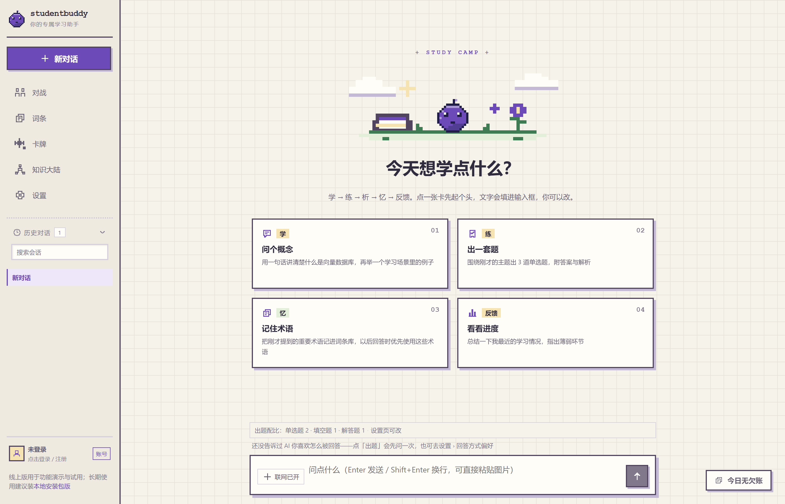
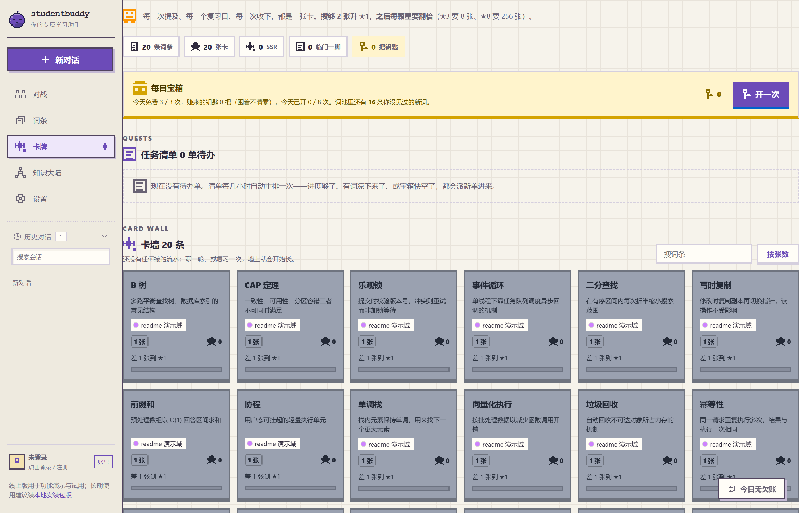
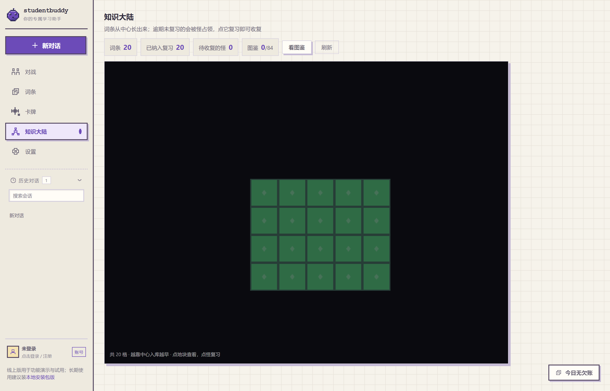

# StudentBuddy

**从一个没弄懂的问题开始。**

StudentBuddy 是一个以对话为起点的学习伙伴。你可以让 AI 解释概念、结合资料回答问题，把想记住的知识留成词条，再通过复习和答题看看自己掌握了多少。

读完一段解释时觉得懂了，过几天却又说不清楚，是学习里很常见的事。StudentBuddy 想把提问之后的这几步也照顾到：留下什么、什么时候再看、能不能自己答出来。

这几步现在做成了像素风的样子：学过的词条会攒成卡牌，也会铺成知识大陆上的地块；到期该复习的词条变成怪物占住地块，答对了就把地块收复回来。

[在线体验](https://11wand.com) · [本地运行](#快速开始) · [更新记录](https://11wand.com/changelog/index.html) · [反馈问题](https://github.com/llwand1/studentbuddy-v2/issues)

## 在 StudentBuddy 里学一次

### 先把卡住的地方聊明白

比如，你正在学 JavaScript，却一直没弄懂闭包。可以直接问：

> “闭包到底保存了什么？用一个计数器的例子讲讲。”

你可以接着追问某一句解释，让回答更简短，或多给一个例子。读资料时，也可以把正文或支持的文件交给它，围绕资料继续聊。需要查外部信息时，可以开启联网搜索。

### 把下次还想用的知识留下来

聊完后，可以让 AI 把值得记住的概念整理进词条库。词条有解释和别名；以后在回复中再次遇到这些词，可以直接打开词条卡片回看。

反复碰上、反复复习的词条会攒成卡牌：碰到的次数越多，星级越高，卡墙里一眼看得出自己收了哪些、还差哪些。想练的词条可以加入复习范围，按复习安排回来过一遍。刚弄懂的“闭包”，也就有了下一次见面的机会。

### 试试自己能不能答出来

在对话里说“考考我”，可以围绕刚才的内容生成练习。想换个节奏，也可以进入 PK，和 AI 对战，或者建房邀请朋友一起答题。

从听懂解释，到自己作答，中间往往还差一点。答错的地方，可以回到对话里继续问。

### 过几天回来，把地块收复回来

到了该复习的时候，知识大陆上对应词条的地块会冒出怪物。点进去答题，判断、选择、填空、连线四种题型按等级出题；全部答对，地块收复回来，图鉴里多记一笔。地图只增不减——忘了只是地块褪色长草，不会把你已经铺出来的东西抹掉。

## 界面

下面是**真机截图**：无头浏览器直出，按仓库当前源码在本地形态渲染，不是设计稿也不是拼接。跑图用的是一个临时隔离库，往里灌了一小批示例词条，好让卡墙和地图上有东西可看——跑完即删，不碰真实数据，也不调用模型。

**进去第一眼** —— 像素营地和五环流程卡：点一下就把那句话填进输入框，可以接着改



**词条卡牌** —— 上面是每日宝箱与任务清单，下面是按星级铺开的卡墙



**知识大陆** —— 词条从中心往外铺成地块，越靠中心说明学得越早



## 现在能做什么

| 你想做的事 | 对应功能 |
| --- | --- |
| 弄懂一个概念，追问看不懂的地方 | AI 对话、回答方式偏好、文档问答、联网搜索 |
| 保存知识，之后能再找到 | 词条库、AI 整理、回复中的词条高亮与卡片 |
| 看到自己攒下了什么 | 词条卡牌：卡墙、星级、收藏进度、每日宝箱、任务清单 |
| 回顾自己选定的内容 | 词条复习范围与间隔复习 |
| 把复习当成一次收复 | 知识大陆：词条地块、到期怪物、四题型挑战、图鉴 |
| 检查理解，和朋友一起练 | 对话出题、AI 对战、邀请好友 PK |
| 用自己的模型和数据环境 | 自定义 AI 服务商、本地运行或自行部署 |

界面是一整套像素风主题：聊天、词条、卡牌、知识大陆、对战与设置共用同一套配色和图标，手机上另有底部导航，系统打开「减少动态效果」时动画会让位。

网页版已上线到 **v0.2.136**。具体变化见[更新记录](https://11wand.com/changelog/index.html)；GitHub 主分支和开发分支可能包含尚未部署的改动。

题库页面、笔记、今日总结已下线，出题能力保留在对话与对战里；这些已下线功能的设计存档仍在文档索引里可查。

## 这一版走到哪了

像素界面、词条卡牌和知识大陆已经随 **v0.2.136** 上线，打开站点就能看到。

还没做的部分说清楚：地图上没有角色自由走位和领地扩散，宝箱掉落也还没和地图联动；历史副本、情景题与 Boss 对战排在后面。这些都会围着实际学过的内容做，玩法随开发和体验反馈调整，不为了好看先塞进产品。

## 快速开始

### 直接使用网页版

打开 **[11wand.com](https://11wand.com)**，注册后开始使用。首页也提供“免注册，直接体验”入口。

免注册入口使用公用体验账号，内容可能被其他访客看到。想保存自己的学习记录，请注册独立账号。

### 在自己的电脑上运行

需要 Git 和 **Node.js 22.11 或更高版本**。安装依赖和启动应用时请使用相同的 Node 主版本；切换主版本后需重新安装依赖。

```bash
git clone https://github.com/llwand1/studentbuddy-v2.git
cd studentbuddy-v2
npm ci
npm run dev
```

浏览器打开 **http://localhost:5173**。首次使用时，在设置页添加 AI 服务商，填入服务地址、API key 和模型名称。

本地运行时，学习记录保存在本机的 SQLite 数据库中；调用外部模型或搜索服务时，相关请求内容仍会发送给对应服务商。网页版的记录保存在服务器上。

不配置真实模型也可以运行 `npm run demo:e2e`，查看使用模拟模型的自动化演示。它用于验证应用流程，不会调用真实模型。

### 配置说明

| 设置 | 在哪里配置 |
| --- | --- |
| AI 服务商与模型 | 应用设置页；支持 OpenAI 兼容协议及 Anthropic 适配 |
| 联网搜索 | 设置页，或 `EXA_API_KEY` / `TAVILY_API_KEY` / `ZHIPU_API_KEY` 环境变量；未配置时有免 key 通道兜底 |
| 本地数据目录 | `SB_DATA_DIR`；默认放在系统的应用数据目录 |
| 多用户部署、邮件与 GitHub 登录 | 按[部署手册](DEPLOY.md)配置 |

Docker 部署仍为实验性方案，尚未完成实机验证。自建服务请先阅读部署手册中的运行、备份与回滚说明。

## 开发与贡献

仓库使用 TypeScript，前端是 React，服务端是 Express，数据存储使用 SQLite。代码分为三个 npm workspace：

```text
packages/shared   前后端共用的类型与规则
packages/server   对话、词条、复习、对战与数据存储
packages/web      网页界面
docs              功能设计、接口约定与测试记录
tools             开发、测试与部署工具
```

修改前请先读 [AGENTS.md](AGENTS.md) 中的项目约定。提交前运行：

```bash
npm run build
npm run check
node tools/metrics.mjs --tests --check
```

构建需要先于检查执行，因为部分测试会检查构建后的文件。`check` 包含类型检查、lint、测试和代码规范检查；`metrics` 核对 README 中的工程数字。

如果某次解释不清楚、复习流程不顺手，或对战中遇到问题，欢迎[提交 issue](https://github.com/llwand1/studentbuddy-v2/issues/new/choose)。附上操作步骤和预期结果，会更方便定位。

<details>
<summary>工程指标与版本说明</summary>

[](https://github.com/llwand1/studentbuddy-v2/actions/workflows/ci.yml)


测试基线：**213 文件 / 2887 例**（2886 passed + 1 skipped + 0 failed）。指标由 `tools/metrics.mjs` 核对，详情见[工程指标](docs/metrics.md)与[测试计划](docs/dev/test-plan.md)。

`v0.2.x` 表示对外发布的构建版本；`package.json` 中的 `2.0.0-alpha.0` 表示 v2 产品开发线。查看线上变化请以公开更新记录和 GitHub Releases 为准。

</details>

## 文档索引

| 想了解的内容 | 从这里开始 |
| --- | --- |
| 像素界面与交互 | [像素 UI 说明](docs/PIXEL-UI.md) · [知识大陆接入](docs/KNOWLEDGE-CONTINENT-SPEC.md) · [卡牌规则](docs/TERM-CARDS-SPEC.md) |
| 自己部署、备份与恢复 | [部署手册](DEPLOY.md) |
| 技术架构与设计取舍 | [工程导览](docs/INTERVIEW.md) |
| 词条、复习与长期记忆 | [词条整理](docs/TERM-TIDY-SPEC.md) · [词条卡片](docs/TERM-HIGHLIGHT-SPEC.md) · [复习规则](docs/EBBINGHAUS-SPEC.md) · [长期记忆](docs/MEMORY-SPEC.md) |
| 文档问答与对话呈现 | [文档检索](docs/DOC-RAG-SPEC.md) · [回答偏好](docs/ANSWER-STYLE-SPEC.md) · [交互提问](docs/ASK-CHOICE-SPEC.md) |
| 对战玩法 | [PK 设计](docs/PK-SPEC.md) · [对战演示](docs/PK-DEMO-SPEC.md) |
| 接口与账号 | [事件和接口约定](docs/SSE-CONTRACT.md) · [账号](docs/AUTH-SPEC.md) · [数据归属](docs/TENANCY-SPEC.md) |
| 开发与测试记录 | [项目改动](CHANGELOG.md) · [测试计划](docs/dev/test-plan.md) · [问题记录](docs/dev/bug-ledger.md) · [人工验收](docs/dev/manual-test.md) |

<details>
<summary>更多设计文档与历史记录</summary>

- 学习辅助：[记忆联动](docs/MEMORY-TREND-SPEC.md)、[学习提醒](docs/COACH-SPEC.md)、[场景卡](docs/SCENARIO-SPEC.md)。
- 练习设计：[出题配图](docs/QUIZ-IMAGE-SPEC.md)、[出题检索](docs/QUIZ-SEARCH-SPEC.md)、[薄弱点分析](docs/QUIZ-WEAK-SPEC.md)、[学习素材搜集](docs/RESOURCE-SPEC.md)。
- 工程与发布：[工具扩展](docs/TOOL-ECOSYSTEM-SPEC.md)、[SEO](docs/SEO-SPEC.md)、[GitHub 维护](docs/GITHUB-OPS-SPEC.md)、[上线记录](docs/dev/launch-plan.md)。
- 产品记录：[产品度量](docs/metrics-product.md)、[项目增长](docs/project-growth.md)。
- 已移除功能的设计存档：[学习流与知识图](docs/STUDY-FLOW-SPEC.md)、[深度理解](docs/DEEP-UNDERSTANDING-SPEC.md)、[刷题笔记](docs/QUIZ-NOTES-SPEC.md)、[题库与薄弱点](docs/QUIZ-WEAK-SPEC.md)。这些文档保留历史设计，不代表当前功能。
- v1 用户迁移：仓库提供 `tools/migrate-from-v1/migrate.mjs`，先用 `--dry-run` 查看报告，再按需用 `--run` 执行；迁移前请备份数据。

</details>

本仓库是 StudentBuddy v2。[v1 仓库](https://github.com/llwand1/studentbuddy)已冻结，后续开发在这里继续。

采用 [MIT 许可证](LICENSE)。
