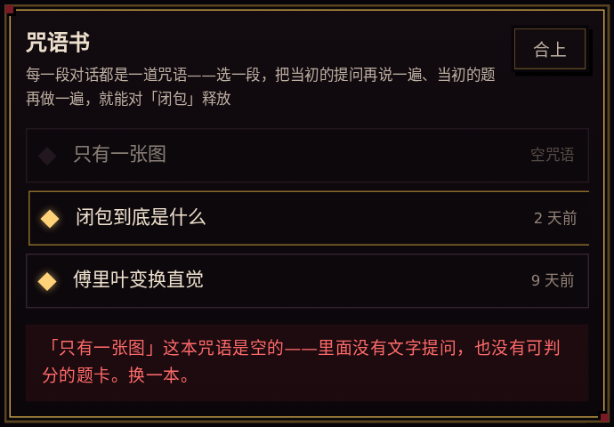
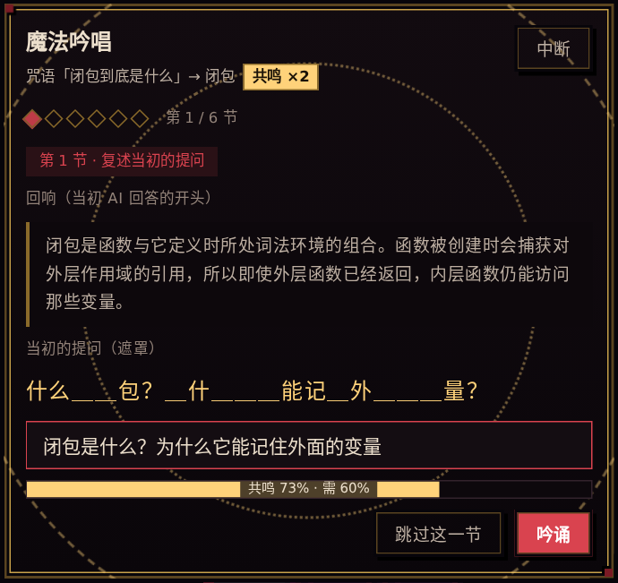
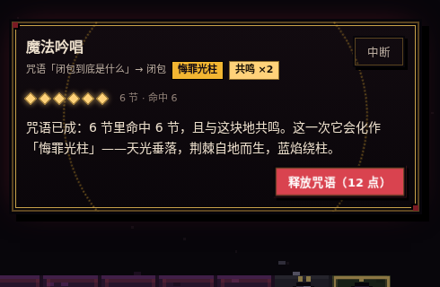
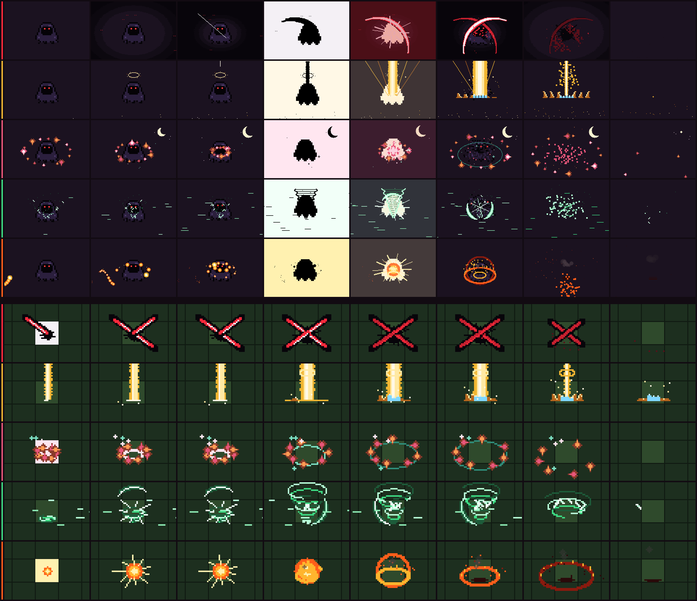
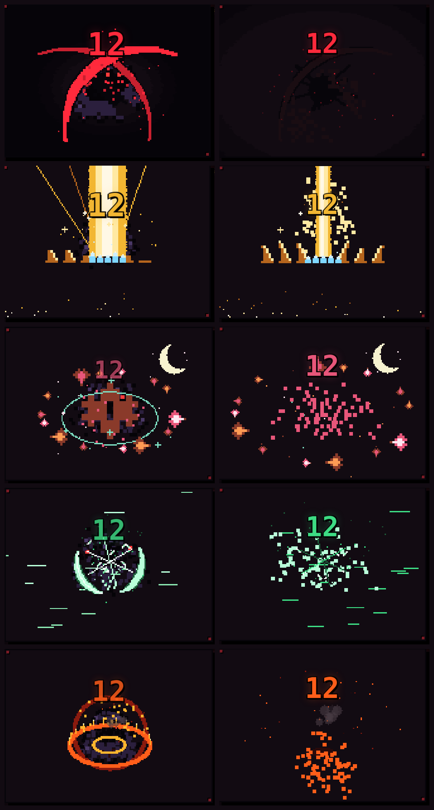
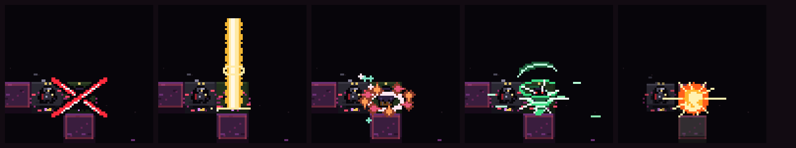

# 魔法吟唱（Spell Chant）——对话核 × 知识大陆

> 版本：v0.1 | 状态：[活跃] | 新建：2026-09-28（issue #85，分支 `feat/spell-chant`）
>
> 本册管的是知识大陆里的一个**技能位**：把「对话核」产出的历史对话当作**咒语**，在打怪弹窗里对指定怪物**吟唱并释放**。
> 它是 `docs/KNOWLEDGE-CONTINENT-SPEC.md` 的子契约：地图、怪、血量、收复路径全部沿用那册的口径，本册**只加一种打法**。

## 1. 为什么要有它

- 对话核与知识大陆之间此前只有**数据连接**（对话里沉淀的词条铺成地块），没有**玩法连接**。一段对话结束后，它在地图上没有任何存在感。
- 学习者投入最多的地方是对话（从一个感兴趣的问题出发，一轮轮问答 + AI 出的题卡），但历史对话只会被翻阅，**不会被重新打开、重新复述**——与已下线的知识图同型：写侧持续付成本、读侧近零访问。
- 魔法吟唱把每一段对话变成一件**能在地图上使用的东西**：要用它，就得把当初的提问再说一遍、把当初的题再做一遍。技能的威力由这些学习行为解释。

## 2. 概念映射

| 游戏里叫什么 | 它其实是什么 | 来源 |
| --- | --- | --- |
| **咒语** | 一个会话（一段历史对话） | 既有 `GET /api/sessions` |
| **咒语书** | 本账号的会话列表 | 同上 |
| **一节（verse）· 复述提问** | 对话里的一轮：用户提问 + AI 回答 | 既有 `GET /api/sessions/:id/messages` → `foldToolRounds` |
| **一节（verse）· 重做题目** | 对话里 AI 出过的题卡上的一道题 | 同上（`[QUIZ]` 登记行还原） |
| **回响** | 该轮 AI 回答的前 `SPELL_ECHO_CHARS` 字（去掉标记与围栏） | 派生 |
| **共鸣** | 咒语正文里出现了这块地的词条名 | 派生 |
| **威力 / 伤害** | 命中的节数 ×（共鸣 ? 2 : 1） | 派生 |

★ **全部是派生量**：没有一张新表、没有一条迁移、没有一个新 REST 路由。吟唱过程**不落库**，关掉弹窗就没了。

## 3. 行为

### 3.1 入口（`MonsterDialog`）

- 打怪弹窗底栏多一个「魔法吟唱」按钮，与「提交」并列。
- **一只怪一次开打只能吟唱一次**：释放过（含哑火）或**中途中断**，按钮即置灰为「吟唱已用」并留一句话说明；合上咒语书（还没选）不算用掉。关掉弹窗再开算新的一次开打。
- 吟唱期间弹窗内的常规答题不可操作（同一时刻只有一个对话框在前）。

### 3.2 咒语书（`SpellBook`）

- 打开即拉 `api.sessions.list()`；列表按服务端次序（置顶优先、最近更新在前）。
- 点一本 → 拉 `api.sessions.messages(id)` → `planSpell(rows, term)`（`spell-chant-view.ts`）：
  - `foldToolRounds` 折成消息流 → `buildChantVerses` 切成节；
  - **0 节**（没有文字提问、也没有可判分的题卡）⇒ 就地说「这本咒语是空的」，**不进入吟唱**、不消耗吟唱机会；
  - 节数超过 `SPELL_MAX_VERSES = 8` ⇒ 只取**前 8 节**并如实提示「咒语太长，只吟唱前 8 节」。
- 取数失败原样念出错误（ADR-5 禁静默），可重试。

### 3.3 吟唱（`SpellChant`）——逐节推进

**复述提问**（recall）
- 屏上有两样东西：① **回响**——该轮 AI 回答的摘录；② **遮罩后的原提问**——`maskPrompt(prompt, seed)` 按稳定哈希露出约三分之一的字符（首字必露、标点与空白原样保留），其余以 `＿` 遮住。
- 学习者输入一句提示词，相似度实时显示（`promptSimilarity`：NFKC / 去空白与标点 / 小写后的**字符二元组多重集 Dice 系数**，`[0, 1]`）。
- 相似度 ≥ `resonanceThreshold(原提问归一后的长度)` ⇒ **共鸣**，该节命中（`hit`）；唯一入口是 `resonates(prompt, attempt)`，组件不自己比数。阈值随原提问长度线性递减：长度 ≤ 20 字为 `0.6`，≥ 60 字为 `0.4`，中间线性——长句本来就不可能逐字复述，阈值不降就是把人卡死。
- 允许「跳过这一节」⇒ 该节失谐（`miss`）、威力 0。不许跳过会造出死路（想不起来就永远出不去）。

**重做题目**（quiz）
- 只收**可客观判分**的题（`chantable`）：`single` / `multiple` / `judge` / `fill` 且答案形状完整（选择题下标在选项内、填空有答案）；`essay` 不进吟唱（没有机器可判的对错）。每张题卡最多取前 `SPELL_MAX_QUIZ_PER_CARD = 3` 题。
- 判分复用对话页题卡同一份口径（`features/quiz/quiz-attempt.ts` 的 `reviewAttempt`，`verdict === 'correct'` 才算对）——**不另写第二份判分**。
- **一次作答**：对 ⇒ `hit`；错 ⇒ `miss`，亮出正确答案后进入下一节。与打怪常规题「答错可重试」刻意不同：吟唱是**回忆练习**，看过答案再答一遍不叫回忆。

**进度**：每节一枚符文；命中亮金、失谐暗色、当前节红色脉动、未到的空框。

### 3.4 释放

- 全部节走完 ⇒ 出现「释放咒语（N 点）」（一节没中则是「释放（哑火）」）。点下去播放释放特效；`prefers-reduced-motion` 下不播、直接显示结果。结算文案念出「N 节里命中 M 节（共鸣加倍），化作「款式名」：造成 D 点伤害」，点「回到战斗」才把伤害交回打怪弹窗。
- **款式（`shared/spell-kinds.ts`）**：每次吟唱开始时**掷一次骰**（`pickSpellKind(rng)`，默认 `Math.random`，可注入），从五款里定一款——整段吟唱到释放都是同一款，卡片边框 / 内圈 / 头部标签「款式名」/ 伤害数字随之染色（`.spell-card.kind-<kind>` → `--spell-accent`），「释放」前的提示句会预告「这一次它会化作「X」——一句画面描述」。**款式只改画面，不改数值**：打多少仍由 `chantPower` / `spellDamage` 说了算。

  | id | 招式名 | 画面 | 时长 / 命中帧（ms） |
  | --- | --- | --- | --- |
  | `dusk` | 无光斩 | 椭圆黑幕一圈圈收拢、十四只红眼睁开 → 两道白刃十字劈开 → 墨迹炸开、血珠飞溅 | 1600 / 560 |
  | `grace` | 悔罪光柱 | 金色光尘上升、光环与念珠悬于头顶 → 一线天光落成三层光柱 → 地面溅光、荆棘自地而生、蓝焰绕柱、九星金光 | 1900 / 560 |
  | `leaf` | 月下叶舞 | 新月当空、十四片枫叶螺旋收拢 → 花印亮起 → 叶片炸开成花瓣、青环扩散 | 1800 / 640 |
  | `sylph` | 风灵旋刃 | 风线掠过、旋涡拢起 → 分层龙卷拔地 → 三道风刃穿过留下切口、羽片火花四散 | 1700 / 600 |
  | `salamander` | 炎蛇 | 火蛇盘绕三匝逼近 → 一口咬下炸成火球 → 火环两重、地面火圈带刺、三十二粒余烬、黑烟与焦痕 | 1800 / 620 |

- **释放特效引擎（`features/continent/spell-fx*.ts`，纯 canvas）**：低清画布（高 `FX_H = 120`，宽按卡片长宽比钳在 120–260）由 CSS `image-rendering: pixelated` 拉满卡片，15 fps 定格（`FX_TICK_MS`，帧间不插值），只用整数 `fillRect` 铺像素；颜色走**色阶而不是透明度**（透明度只用于整屏闪白 / 黑幕 / 烟）；随机量来自 `seed`（mulberry32 + 无状态 `hash`），`draw(ctx, ms)` 是 (seed, ms) 的纯函数——同 seed 逐帧相同，截图与测试可复现。五款共用的骨架：怪（幽魂精灵 ×3）先摇晃 → 命中帧**整屏负片**（黑剪影落在各款自己的纸色上）→ 下一帧整屏色洗 + 放射冲击线 → 各款自己的消散（切断 / 升天 / 化瓣 / 卷走 / 成灰）。命中帧与总时长**只写在 `SPELL_KIND_META`**：DOM 计时器（伤害数字在 `impactMs` 弹出 + 卡片 `steps()` 震动，`durationMs` 切结算）与 canvas 编排查同一张表，`spell-fx.test.ts` 锁两边相等。
- **伤害** = `spellDamage(power, resonant)` = `power × (resonant ? SPELL_RESONANCE_MULTIPLIER : 1)`，其中 `power = chantPower(results)` = 命中节数，`resonant = spellResonates(会话全部消息正文, 词条名)`。
- 回到打怪弹窗：
  - `damage ≥ 剩余血量` ⇒ **收复**，走既有 `onSolved(tile, kind)` → `api.terms.mark(id, true)`（与常规答完一字不差的写口；`kind` 只用来选特效）；
  - `0 < damage < 剩余血量` ⇒ 扣 `damage` 滴血＝**跳过同样数量的题**（「题数＝血量」的口径不破），剩下的血仍靠常规答题打掉；
  - `damage = 0` ⇒ **哑火**：不扣血，但这一次吟唱机会已用掉。
- 地图击杀特效（`features/continent/spell-burst.ts`）：吟唱收复时 `burst` 带上款式（`ContinentBurst.spell?: SpellKind`），`drawBurst(ctx, t, age, spell)` 改画**同款的地图版**——与吟唱框同调色板、同笔刷，坐标系 `scale(3)` 后按 16 单位/格作画（像素颗粒与地图上的怪一样粗）：无光斩十字斩痕 + 墨迹 / 悔罪光柱落柱 + 荆棘 + 蓝焰 + 光环 / 月下叶舞青环 + 枫叶 / 风灵旋刃小龙卷 + 三刃 + 羽片 / 炎蛇火球 → 火环 → 焦痕；时长 `SPELL_BURST_MS = 900`（仍在 1 秒预算内）；普通收复不变。页面横幅念「「款式名」命中，收复了「词条」」。

## 4. 数值由学习行为解释（本仓纪律）

- **威力 = 命中节数**：复述一次提问 = 一次主动回忆（要把当初的问题从记忆里取出来，而不是重读一遍）；重做一题 = 一次检索练习。跳过 / 答错 = 0，没有空转的数值。
- **共鸣 ×2**：咒语正文提到这块地的词条 ⇒ 这次回顾对该词条是**直接复习**，强度更高。
- ★ **代价如实登记**：当 `power ≥ 剩余血量` 且咒语与这块地**不共鸣**时，被收复的词条本身可能一题都没答。这是玩法取舍——换来的是「一段历史对话被重新打开、逐节复述」这件比一道本地填空题**更重**的学习行为；且共鸣加成让"选一段相关的对话"始终是更优解。本册**不做**开关，把这条写在这里就是为了让它可被质疑。

## 5. 边界与不做

- 零新表、零迁移、零新 REST 路由；不落任何吟唱记录（要"吟唱次数统计"就得建账，另立改动）。
- 相似度是**本地纯函数**，不调用模型、不发请求；不宣称语义判分。
- 不改对话核任何一行；不改题卡的判分口径（复用）。
- 不做咒语稀有度 / 等级 / 冷却 / 跨怪叠加；不做失败惩罚。
- 图片提问（无文字）、空提问、`essay` 题、情景题（`[SCENARIO]`）不进吟唱。
- 「一只怪一次开打只能吟唱一次」的计数是**弹窗内存态**，关掉重开会重置——如实登记为已知边界。

## 6. 代码落点

| 层 | 文件 | 放什么 |
| --- | --- | --- |
| shared | `packages/shared/src/spell-chant.ts` | 常量、`ChantTurn`/`ChantVerse`/`ChantPlan` 类型、`chantable`、`buildChantVerses`、`echoOf`、`promptSimilarity`、`resonanceThreshold`、`resonates`、`maskPrompt`、`spellResonates`、`chantPower`、`spellDamage`（**纯函数，零随机零时钟**） |
| web | `features/continent/spell-chant-view.ts` | 历史行 → 节（借 `chat/history-fold`）、`planSpell`、`spellTimeText`、文案（`verseTitle` / `truncatedText` / `castText`） |
| web | `features/continent/SpellBook.tsx` | 咒语书（会话列表 + 取数） |
| web | `features/continent/SpellChant.tsx` + `SpellQuizVerse.tsx` | 吟唱对话框（复述节 / 题目节 / 释放） |
| shared | `packages/shared/src/spell-kinds.ts` | 五款款式表 `SPELL_KINDS` / `SPELL_KIND_META`（名字、一句画面、时长、命中帧）、`pickSpellKind(rng)`、`isSpellKind` |
| web | `features/continent/spell-fx.ts` + `spell-fx-core.ts` / `spell-fx-art.ts` / `spell-fx-gothic.ts` / `spell-fx-elements.ts` | 释放特效引擎：入口（建场景 / 定格 / 震屏）、像素笔刷与粒子与靶子、像素图与调色板、无光斩 + 悔罪光柱、月下叶舞 + 风灵旋刃 + 炎蛇 |
| web | `features/continent/spell-fx-soft.ts` | 软件栅格器（`fillRect` 子集）：测试与 `tools/probes/spell-fx-sheet.mts` 在纯 Node 里把帧真的画出来 |
| web | `features/continent/SpellFx.tsx` | 画布壳：rAF 驱动 `createSpellScene`，帧序号变了才重画，到时长即停 |
| web | `features/continent/spell-burst.ts` | 地图版收复特效（五款，`SPELL_BURST_MS`） |
| web | `features/continent/spell-chant.css` | 舞台 / 伤害数字 / 卡片震动 / 款式染色（只动 `transform` / `opacity`，`steps()`，reduced-motion 逐条降级） |
| web | `MonsterDialog.tsx` / `ContinentPage.tsx` / `continent-view.ts` / `ContinentMap.tsx` / `continent-canvas.ts` | 技能按钮与伤害结算（`onSolved(tile, kind?)`；常规答完仍不传第二参）/ `solve(tile, spell?)` → `burst.spell` / `ContinentBurst` 类型 / `burstMs(spell)` + `drawBurst` 转交 `spell-burst.ts` |
| tools | `tools/probes/spell-fx-sheet.mts` | 接触印相：五款 × 8 帧（吟唱框）＋五款 × 8 帧（地图版）拼成 `docs/images/spell-fx-kinds.png`，改编排后重跑、评审对着 diff 看 |

## 7. 验证

- 单测：`packages/shared/src/spell-chant.test.ts`（纯函数口径）、`packages/shared/src/spell-kinds.test.ts`（五款表齐全、掷骰只落在表内且 rng 越界钳住、时长/命中帧合理）、`features/continent/spell-chant-view.test.ts`（历史行切节与共鸣、结算句带款式名）、`SpellChant.test.tsx`（复述通过/不通过/跳过、题目对/错、释放伤害与共鸣倍率；假时钟走完释放：命中帧才出伤害数字与 `struck`、到时长才结算、`onCast` 的 `detail.kind`；不传 `kind` 则掷到五款之一）、`SpellBook.test.tsx`（列表 / 空咒语 / 选中）、`MonsterDialog.test.tsx`（技能按钮、扣血、吟唱收复走 `onSolved(tile, kind)`、一次开打只一次）。
- ★ **特效引擎的像素断言（`features/continent/spell-fx.test.ts`，纯 Node）**：用 `spell-fx-soft.ts` 的软件栅格器把每一帧真的画进 RGBA 缓冲再看像素——五款的命中帧常量 === `SPELL_KIND_META[kind].impactMs`；整条时间线每帧可画且只用 `fillRect` 子集；**调色板纪律**（一款只用自己的 `FX_PAL[kind]` + 幽魂色 + 三个公共色，地图版同）；命中帧满覆盖且平均亮度 > 0.75、前一帧 < 0.4；靶区命中前覆盖 > 0.5、收尾 < 0.1；同 seed 逐帧相同、异 seed 不同；画布尺寸钳位；地图版五款 ≤ 1s、有像素、不糊满、过时长即净、同帧逐像素相同。
- ★ **接触印相（`tools/probes/spell-fx-sheet.mts`）**：`npx tsx tools/probes/spell-fx-sheet.mts [输出] [seed]` 把五款 × 8 个时间点（起手 / 蓄力 / 命中前一帧 / 命中帧 / 命中后一帧 / 爆发 / 消散 / 收尾，按各款自己的 `impactMs` / `durationMs` 取）与地图版五款 × 8 帧拼成 `docs/images/spell-fx-kinds.png`。本次编排就是对着它逐帧改出来的（三轮：收尖的弯刃 / 冲击线 / 星光 / 纸色负片 / 荆棘 / 龙卷分层 / 色洗 / 墨迹 / 天光；黑幕从矩形条改成阶梯椭圆——矩形条在红洗下像 UI 色块；命中相关的切换统一改成 `after()` 语义，负片帧不再比 DOM 计时器晚一帧）。
- ★ **浏览器实跑（headless Chromium，2026-09-28）**：对着真 dev server（`SB_DATA_DIR` 隔离库）＋ vite 页面走完整条链——SQL 灌入 3 段会话（其中一段带 `[QUIZ]` 题卡、一段只有图片提问）与 3 只逾期怪 ⇒ 点怪开弹窗 → 「魔法吟唱」→ 咒语书三本按更新时间排列（「只有一张图」被判空咒语、置灰不进吟唱）→ 「闭包到底是什么」切成 6 节（3 复述 + 3 题，`essay` 被剔除）→ 复述相似度 73% ≥ 60% 放行、故意答错判断题得一节失谐 → 「释放咒语（10 点）」= 5 命中 × 共鸣 2 → 3 血的怪被收复，页面横幅「…命中，收复了「闭包」」，`terms.mark` 真的写了库（再开地图怪已消失、地上留箱）。**五款各跑了一遍**（`add_init_script` 钉住 `Math.random` 让掷骰落到指定款，每次收复后 SQL 把词条拨回逾期再来）：卡片的 `kind-<kind>` 类、款式标签、预告句、命中帧后 `.spell-cast-num` 出现与 `struck` 挂上、结算句「…化作「X」：造成 12 点伤害！」、地图横幅「「X」命中，收复了「闭包」」五款全部对上；浏览器里低清画布为 163×120、拉到 454×334。截图：`docs/images/spell-chant-book.png` / `spell-chant-recall.png` / `spell-chant-ready.png`（款式标签 + 预告句）/ `spell-chant-cast.png`（五款：命中帧 + 命中后 300ms，浏览器实拍）/ `spell-chant-map-burst.png`（五款地图版，浏览器实拍）。
- ⚠️ **仍未做的**：真实设备与多浏览器（只跑了 headless Chromium）、`prefers-reduced-motion` 下的画面（只在 jsdom 里锁了「跳过释放阶段」）、canvas 在**浏览器里**的几何断言（像素断言在软件栅格器上做，真 canvas 的 `fillRect` 语义一致但没再量一遍）。`ContinentPage` 里 `solve(tile, kind)` → `burst.spell` 那一行接线没有页面级用例（`ContinentPage.test.tsx` 已贴近 300 行红线），由类型（`SpellKind`）、`MonsterDialog.test.tsx` 的 `onSolved(tile,'dusk')` 断言与浏览器实跑兜住。

## 8. 画面

| 咒语书 | 复述一节 |
| --- | --- |
|  |  |

掷到「悔罪光柱」的那一局，释放前的卡片（款式标签随款染色、预告句）：

五款释放特效的接触印相（上五行：吟唱框里的释放，每行 8 个时间点；下五行：同款在地图上的收复特效；`tools/probes/spell-fx-sheet.mts` 生成，seed 20260928）：

浏览器实拍（headless Chromium，每行一款：左 = 命中帧附近，右 = 命中后约 300ms；自上而下 无光斩 / 悔罪光柱 / 月下叶舞 / 风灵旋刃 / 炎蛇）：

地图上的咒语版收复特效（浏览器实拍，回到战斗后约 180ms 的一帧，五款同序）：

